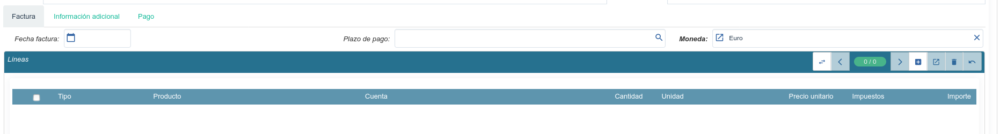

#:before:account/account_invoice:section:cancelar#

.. inheritref:: account_invoice_line_standalone/account:section:lineas_pendientes_de_facturar

------------------------------------
Añadir líneas pendientes de facturar
------------------------------------

En sistemas de automatización de facturación se genera facturas a partir de
líneas a facturar. Esto se muy común por ejemplo en el proceso de contratos de
servicios se generen líneas, y al fin de mes, se facturen.

.. inheritref:: account_invoice_line_standalone/account:paragraph:cuando_crea_una_factura

Cuando crea un nueva factura, al seleccionar el tercero, en las líneas de la
factura, podrá seleccionar líneas existentes pendientes de facturar.

.. note:: Sólo podrá seleccionar las líneas de factura del tercero de la
   factura y que no sean facturadas previamente.
