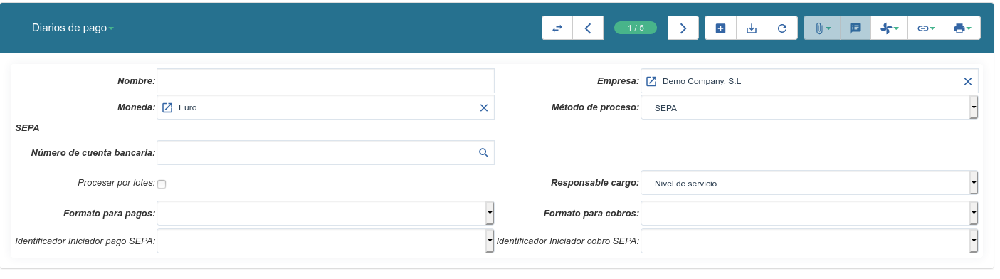

.. inheritref:: account_payment/account_payment:section:pagos

Configuración
-------------

.. inheritref:: account_payment/account_payment:paragraph:configuracion

**Tryton** gestiona los cobros y los pagos a través de los |payment_journal|,
por lo que antes de realizar cualquier gestión, deberemos configurar al menos
uno. Para ello accederemos a |menu_payment_journal| y en la pestaña que se nos
abrirá clicaremos en *Nuevo*. Cumplimentaremos un formulario que se nos
mostrará, como el que sigue en la imagen.

   Formulario para crear un diario de pago

.. view:: account_payment.payment_journal_view_form

Dentro del listado de Métodos de proceso entre otros podemos encontrar los
siguientes:

 - SEPA CORE DIRECT DEBIT: Método usado para giros
 - SEPA CREDIT TRANSFER: Método usado para hacer transferencias
 - MANUAL: Usaremos este proceso, siempre y cuando no tengamos que generar
   ningún formato electrónico, normalmente en la gestión de pagares o xeques

Los anteriores son los más comunes pero, como vemos, cada uno de estos métodos
va vinculado a un tipo de pago del emisor. Al asignar un método y un tipo de
pago a un diario de pago, los pagos creados en grupos de pago solo podrán ser
del mismo tipo que los del diario.

Una vez ya tengamos configurado al menos un diario, podremos acceder al listado
de los efectos a pagar o cobrar y también podremos informar pagos o cobros en
el sistema.

Listar efectos pendientes de cobro o pago
------------------------------------------

.. inheritref:: account_payment/account_payment:paragraph:efectos

Cuando se confirma un asiento, ya sea porque lo introducimos manualmente o
porque se genera a partir de una factura, se crea a su vez en el sistema un
efecto. Si accedemos a |menu_efects| podremos ver listados todos los efectos
que tenemos pendientes de pagar y cobrar separados por pestañas. Además también
tenemos las pestañas *A pagar con apuntes inversos* y *A cobrar con apuntes
inversos* dónde encontraremos listados los efectos los cuales teniendo el mismo
tercereo tenemos efectos tanto a cobrar como a pagar. Y las pestañas *A pagar
con mandato* y *A cobrar con mandato* que, como bien dice el nombre, son los
efectos de pago o cobro a través de mandatos.

.. inheritref:: account_payment/account_payment:section:informar-pagos

Informar un pago o un cobro
---------------------------

Aunque hay muchas formas de hacerlo, desde el menú |menu_payment| también
podremos informar al sistema del pago o cobro de un efecto. Si introducimos el
|party| y el |kind| de pago, en el campo |line| nos aparecerán todos los efectos
pendientes de pagar del cliente. Una vez seleccionado el efecto el resto de
campos se rellenarán con la información del efecto. Si estamos introduciendo un
anticipo, por ejemplo, y no hay un efecto como contrapartida, tendremos que
rellenar manualmente en resto de campos.

.. inheritref:: account_payment/account_payment:paragraph:aprobar

Para procesar un pago (paso que hacemos después de haber mandado la orden de
pago o cobro al banco) tendremos que acceder a la pestaña *Aprobado*, si hemos
marcado la marca *Aprobar* sino en la pestaña *Borrador*, seleccionar todos los
pagos que se realizarán en la remesa (o uno solo si la orden solo se realiza por
un pago) y tras clicar en el icono *Ejecutar acción* seleccionaremos la opción
*Procesar pagos*. Una vez nos contesten del banco, podremos indicar en la
pestaña *En proceso* si los pagos se han realizado *Con éxito*, o si nos lo han
rechazado y por tanto ha *Fallado*.

Como es el proceso del pago
---------------------------

Un ejemplo del flujo natural a seguir seria el siguiente:
Tenemos dos facturas con Tipo de pago Pagare, ya sean del mismo o diferente
Tercero, y queremos indicar que nos ha llegado el pagare al banco. Nos
dirigiremos a la pestaña *A cobrar* y seleccionamos las dos facturas. Una vez
seleccionadas hacemos clic en el botón acción y, entre otras, tendremos dos
acciones posibles:

 * *Pagar efectos*
 * *Crear grupos de pago*

Con la primera opción pasaremos ambas facturas a pagos sin necesidad de aprobar
ni procesar, así indicaremos que los pagares han sido recibidos en el banco
pero sin aprobar ni procesar (tenemos la opción de marcar el checkbox *Aprobar
pagos*). En este momento seguirá en borrador el pago, así que podemos modificar
todos los datos e información del efecto, como la data efectiva, además de
añadir una descripción.
Pero el paso previo será seleccionar un diario de pago y si queremos, marcar el
check *Aprobar pagos*. Si no aprobamos los pagos de las facturas su estado será
borrador en el menu *Pagos*, y des del mismo menu nos da la opción de aprobar
este pago.
Una vez aprobados los pagos los procesaremos y un asistente nos preguntará si
queremos unir las líneas **(si hacemos grupos de pago no)** y la fecha única en
la que los planificamos, lo que provocará la actualización de la fecha de todos
los pagos antes de crear el grupo de pago.

Con la segunda opción creamos un grupo de pago directamente. Cuando creamos el
grupo de pago cada una de las líneas de pagos que habíamos seleccionado
(facturas) forma parte de este grupo. Hasta que el pago no esta en proceso no
forma parte de ningún grupo, pero aún y estando en proceso seguimos teniendo los
pagos por separado en la pestaña *En proceso* dónde podremos clasificar como
*Fallado* o *Con éxito* cada uno de los pagos del grupo.

El flujo que sigue un pago
--------------------------

Pasos que siguen los efectos en el flujo de pagos:

1.- Se selecciona el efecto a pagar/cobrar se ejecuta la acción *Pagar efectos*

2.- Escogemos un *Diario*, creado previamente, y podemos escoger aprobar estos
pagos o dejarlos en borrador, para poderlos modificar posteriormente

3.- Si no lo hemos hecho, aprovamos los pagos. Esto significa que ya no
podremos hacer ninguna modificación en la fecha, línea o tercero.

4.- Una vez aprovado, lo procesamos. En este paso, podremos unir más de un
pago/cobro y asignar una fecha de planificación para el grupo que se creará (se
creará un grupo ya sea uno o cinco pagos)

5.- En cuanto esté el grupo creado podremos marcar el pago como *Fallado* o
*Con éxito*. Aunque el grupo sume el total de los pagos que lo conforman,
siempre podremos marcarlos como fallo o éxito de forma individual

6.- El efecto una vez marcado como fallado volverá a la lista de Efectos a
pagar/cobrar, dónde se regitra el histórico de ese pago

Una alternativa a esto, saltándose pasos intermedios, si estamos seguros de que
todos los datos del efecto son los definitivos es:

1.- Seleccionar los efectos que queremos pagar y ejecutamos la acción *Crear
grupos de pago*, nuevamente podremos indicar el diario que queramos, unir la
líneas e indicar una fecha de planificación

2.- Una vez realizado este paso ya tendremos el grupo creado y tan solo restará
marcar los pagos como Fallado o Con éxito.

.. note:: Posteriormente podremos acceder a |menu_payment_groups| para acceder
          a la información de la remesa y los pagos de esta.

Si el pago se ha procesado , el efecto dejara de aparecer en el
listado de *Efectos a pagar/cobrar* y si se ha realizado con éxito tampoco
aparecerá en los grupos de pago. Pero si le indicamos que el pago ha fallado
volverá a aparecer en el listado de efectos.

.. |payment_journal| tryref:: account_payment.menu_payment_journal_form/name
.. |menu_payment_journal| tryref:: account_payment.menu_payment_journal_form/complete_name
.. |name| field:: account.payment.journal/name
.. |company| field:: account.payment.journal/company
.. |currency| field:: account.payment.journal/currency
.. |process_method| field:: account.payment.journal/process_method
.. |menu_efects| tryref:: account_payment.menu_move_line_form/complete_name
.. |menu_payment| tryref:: account_payment.menu_payment_form/complete_name
.. |party| field:: account.payment/party
.. |kind| field:: account.payment/kind
.. |line| field:: account.payment/line
.. |menu_payment_groups| tryref:: account_payment.menu_payment_group_form/complete_name
