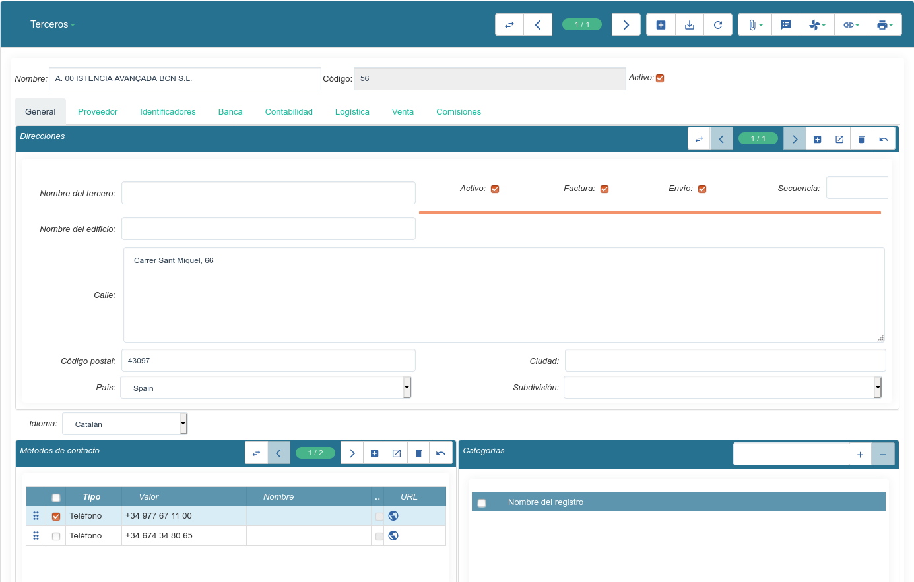

================================
Terceros (clientes, proveedores)
================================

Un **tercero** puede ser un cliente, un proveedor, una persona física o jurídica,
una entidad, una fundación, etc. Aquí encontraremos cualquier contacto relacionado
con nuestra empresa, incluida esta misma y sus empleados.

.. view:: party.party_view_form
   :field: name

.. inheritref:: party/party:section:direcciones

Direcciones
===========

Un tercero puede disponer de varios direcciones. Una dirección está compuesta
del nombre, la calle, el código postal, la ciudad, el estado, una subdivisión (que en el caso de España puede ser la comunidad autónoma,
la provincia o la comarca)

.. image:: images/party-menu.png

.. note:: Para eliminar una dirección, lo haremos con el botón de eliminar de la
          dirección. No usaremos el menú desplegable que aparece cuando hacemos
          clic sobre botón de herramientas superior, ya que en ese caso
          eliminaríamos la empresa.

.. figure:: images/party-m2o-delete.png

   Eliminar campos dentro de la ficha

.. inheritref:: party/party:section:categoria

Desactivar terceros
===================

A veces es necesario poder desactivar un tercero porqué ya no trabajamos con
el mismo, pero esto no es posible porqué ya tenemos algun documento (factura,
presupuesto, etc) que hace referencia al mismo.

En este caso podremos desctivarlo tal cómo se explica en
:ref:`desactivar-registros`.

Clasificar los terceros
========================

Tryton nos permite clasificar los terceros por categorías. Así podremos
establecer tantas categorias cómo queramos para cada tercero.

Entonces podemos utilizar la opción |menu_party_categories| para consultar
todos los terceros de una categoria. Para ello, simplemente hace falta hacer
doble click sobre la categoría y se nos abrirá el listado de todos los
terceros de la misma.

.. |menu_party_categories| tryref:: party.menu_category_tree/complete_name

Trabajar con terceros en multicompañía
======================================

Por defecto, todos los terceros se comparten entre la compañías. Esto significa
que si creamos un tercero en la empresa A, también lo tendremos disponible en
la empresa B. Además podemos utilizarlo sin problemas indisitintamente en una
compañia o en la otra. Lógicamente, los documentos (ventas, compras, albaranes,
facturas, etc.) no se van a compartir y sólo los podremos ver en la misma
compañía en las que han sido creados.

A pesar que los terceros sean los mismos en todas la compañías esto no significa
que  todos los datos de un determinado tercero sean los mismos en todas las
compañías.

A continuación detallamos los campos que dependen de la compañía en terceros:

.. inheritref:: party/party:section:informes

Informes
========

Dispone de dos informes:

* El informe **Etiquetas** crea un documento con el nombre y direcciones de todos
  los terceros seleccionados que están pre-formateados para ser imprimidos en
  etiquetas que se puedan pegar en un sobre.

* El informe **Carta** crea un documento pre-rellenado con la cabecera de la
  compañía, la dirección del destinatario, la fecha, un saludo, un final y la
  firma del usuario que lanza el informe.

.. inheritref:: party/party:section:configuration

Configuración
=============

En |menu_party_configuration| podemos encontrar distintas opciones
que nos permetran adaptar el maestro de tercero a nuestras necesidades.

.. view:: party.party_configuration_view_form
   :field: party_lang

Idioma por defecto de los terceros
~~~~~~~~~~~~~~~~~~~~~~~~~~~~~~~~~~

En el campo |party_lang| podemos especificar el idoma que se utilizará por
defecto para la creación de nuevos terceros. Esto sólo aplicará para los nuevos
terceros creados a partir de este momento, y siempre podremos modificar
manualmente el idioma en caso de que este deba ser distinto del idoma por
defecto.

Hacer editable el código del tercero
~~~~~~~~~~~~~~~~~~~~~~~~~~~~~~~~~~~~

Para poder editar manualmente el código del tercero, sólo hay que dejar
en blanco el campo: |party_sequence|. A partir de este momento podremos
introducir manualmente el código de tercero.

.. |party_sequence| field:: party.configuration/party_sequence
.. |party_lang| field:: party.configuration/party_lang

.. |menu_party_configuration| tryref:: party.menu_party_configuration/complete_name

