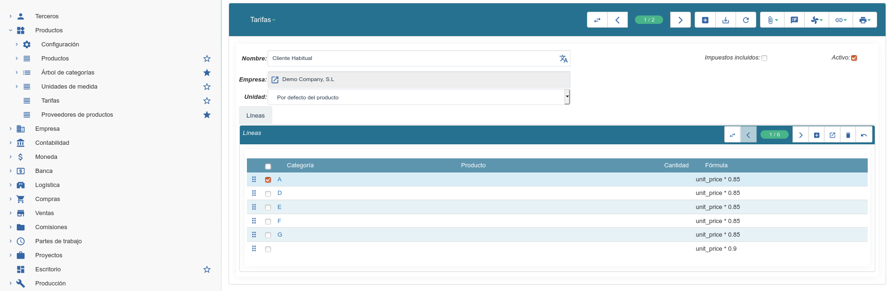

====================
Tarifas de productos
====================

.. inheritref:: product_price_list/price_list:section:tarifas

Por defecto el sistema de tarifas usa el campo **unit_price** (precio de venta) y
a partir de él podemos hacer operaciones.

Por ejemplo, si queremos crear una *Tarifa venta Navidad* y aplicar un descuento
del 10% al precio de venta:::

   unit_price*0.90

   Diseño de una tarifa de precios en Tryton

También dispone de variables extras para calcular su precio final:

.. inheritref:: product_price_list/price_list:bullet_list:product_price_list

* **product**: Acceder a los campos del producto. Por ejemplo, el precio de coste:
  product.cost_price
* **party**: Acceder a los campos del cliente.
* **quantity**: Hacer cálculos con unidades
* **price_list**: Objeto de la lista de precio para calcular tarifas de otras tarifas

Veamos algunos ejemplos para entender el diseño de las fórmulas de tarifas:

* Añadir un 10% al precio de coste:::

   product.cost_price*1.10

* Añadir un 10% al precio de coste y redondeo a 2 decimales:::

   Decimal(round(product.cost_price*1.10,2))

* Una tarifa que dependa de otra tarifa y le añadimos un 10%:::

   price_list.compute_price_list(3)*1.10

En este ejemplo se basa primero de la tarifa ID 3. En el caso de que no exista
esta tarifa, un mensaje de aviso le informará que la tarifa no se encuentra.
Deberá usar un ID válido.

.. note:: Las tarifas de venta sólo se aplican a los **pedidos de venta**. Si
          usted crea una **factura** manualmente se le aplicará el **precio de
          venta del producto**.

.. inheritref:: product_price_list/price_list:section:lineas_en_las_tarifas

Lineas en las tarifas
=====================

En una tarifa añadiremos las diferentes lineas para el cálculo. A cada linea
añadiremos el tipo de cálculo (formula).

* **Fórmula**: La fórmula de cálculo para el precio de venta.
* **Secuencia**: El orden de ejecución.
* **Producto**: Se aplica la linea (fórmula) por este producto solamente.
* **Cantidad**: Se aplica la linea (fórmula) por esta cantidad o mayor.
* **Categoría**: Se aplica la linea (fórmula) por esta categoría de producto.

.. note:: Si diseña líneas por producto o cantidad, estas deben tener un número
          de secuencia más bajo que la linea *general* que esta deberá ser la última.
