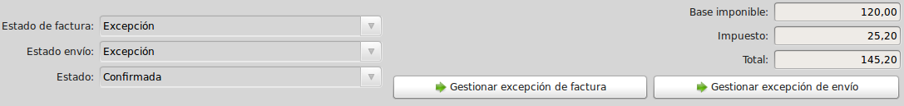
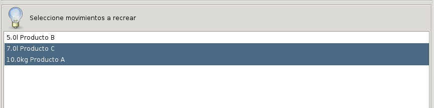

==================
Gestión de Compras
==================

En **Tryton** el concepto de *Compra* no se limita únicamente la compra en sí,
sino que engloba todo el proceso que se llevará a cabo: desde que nos presentan
un presupuesto de compra hasta la formalización del pedido. Todo ello se
gestiona en un mismo documento que irá cambiando de estado según vaya avanzando
el proceso de compra. En primer lugar veremos como crear una compra nueva y
posteriormente profundizaremos en los distintos estados en los que podemos
encontrar la compra.

.. inheritref:: purchase/purchase:section:compra

Crear una nueva compra
======================

Para crear una nueva compra deberemos acceder a |menu_purchase| y se nos abrirá
una pestaña con un listado de las compras introducidas con anterioridad,
clasificadas según el estado en el que se encuentran (*Borrador*,
*Presupuesto*, *Confirmado*, *En proceso*). Además, también podremos ver un
listado con todas las compras realizadas, independientemente de su estado,
desde la subpestaña *Todo* (más adelante, en
:ref:`Flujo de compras <estados-compra>`, veremos más detenidamente cada uno de
los estados). Haciendo doble clic sobre cualquier compra del listado
accederemos a su información concreta y detallada. Si lo que queremos es crear
una compra nueva deberemos clicar sobre el icono *Nuevo* y se nos abrirá el
formulario de edición con los campos que deberemos rellenar para crear la
compra.

.. view:: purchase.purchase_view_form
   :field: party
   
   Captura de pantalla del |menu_purchase|

La compra está compuesta por una parte en la que se define el proveedor con sus
datos (Cabecera), y otra compuesta por varias pestañas que contendrán
información concreta sobre la compra en sí. En la cabecera, una vez indiquemos
el |party| se rellenará automáticamente el campo |invoice_address| con la
información que tengamos en la ficha del |party|, pudiéndola modificar si lo
deseamos.

En la pestaña **Compra** podremos indicar la |purchase_date|, el |warehouse|
que recibirá la compra, la |currency| y el |payment_term|. Estos dos últimos
campos también se rellenarán automáticamente con la información que tengamos
del |party| en su ficha. Por último, tendremos que rellenar el campo |lines|
con la información de los productos que serán objeto de la compra, creando
tantas líneas como productos distintos vayamos a comprar. Para generar una línea clicaremos en el icono *Nuevo* del campo
|lines| y se nos abrirá un ventana emergente con los siguientes campos:

 * |line_type|: Mediante este campo podremos definir distintos tipos de línea.
   El valor por defecto es *Línea*, si mantenemos este |line_type| deberemos
   rellenar también los campos que siguen a este en la explicación. Los otros
   valores son *Comentario*, *Subtotal* y *Título* que se utilizan para añadir
   líneas extras que aparecerán en el informe, permitiendo de esta forma una
   personalización más sencilla. Estos últimos tres tipos se componen
   únicamente de los campos |line_description| y |line_sequence|.
 * |line_product|: Aquí seleccionaremos el producto que vayamos a comprar.
   Establecer un producto es opcional, de todos modos, si queremos generar
   albaranes de proveedor y que se hagan los correspondientes movimientos de
   stock, deberemos seleccionar forzosamente un producto que no sea de tipo
   servicio.
 * |line_description|: En este campo reflejaremos aquello que aparecerá
   como descripción de la línea en la compra. Si indicamos previamente el
   |line_product|, este campo se rellenará automáticamente con el nombre
   del producto, aunque podremos modificarlo.
 * |line_quantity| y |line_unit|: Indicaremos la cantidad y la unidad de
   medida del producto que estamos introduciendo.
 * |line_unit_price|: Cuando indiquemos (o se nos rellene el campo con la
   información introducida en la ficha del producto) el precio por unidad al
   que vendemos el producto, se nos rellenará de forma automática el campo
   |line_amount| con el importe total, teniendo en cuenta la |line_quantity|
   que hemos introducido.
 * |line_taxes|: Si tenemos configurados los productos con el impuesto que
   les corresponde, este campo se nos rellenará automáticamente con la
   información indicada en el producto, si no, deberemos indicar qué impuesto
   gravará la línea de la compra.

.. inheritref:: purchase/purchase:paragraph:generar_albaranes_y_facturas

Si accedemos a la pestaña **Información adicional** podremos indicar en el
campo |invoice_method| en qué punto de la compra queremos que se genere la
factura. Para ello podremos elegir entre:

* *Manual*: No se generará ninguna factura de forma automática y tendremos que
  generar nosotros la factura de forma manual.
  (:ref:`Cómo generar una factura manualmente<gestion-facturas>`).
* *Basado en el pedido*: Una vez la compra cambia a estado *En proceso* se
  generará un factura con todas las líneas del pedido de compra en estado
  *borrador*.
* *Basado en el envío*: Se generará una factura cada vez que se haga efectiva
  la recepción de la mercancía. Si el albarán no contiene todos los productos
  de la compra, sólo se facturarán aquellos productos que hayan sido recibidos.

Como se indica en el apartado :ref:`Configuración<purchase-configuration>`,
podemos configurar el método de facturación por defecto que se mostrarán en las
compras.

.. inheritref:: purchase/purchase:paragraph:la_opcion_de_producto

Desde las pestañas **facturas** y **albaranes** podremos acceder a la
información sobre las recepciones y facturación de la compra. Una vez se
generen los albaranes o facturas, nos aparecerán en sus respectivas pestañas y
podremos acceder a la información concreta de cada documento. En
:ref:`estados-fac-alb-compra` se indica en qué estados nos podemos encontrar 
estos dos documentos.

.. |party| field:: purchase.purchase/party
.. |invoice_address| field:: purchase.purchase/invoice_address
.. |purchase_date| field:: purchase.purchase/purchase_date
.. |warehouse| field:: purchase.purchase/warehouse
.. |currency| field:: purchase.purchase/currency
.. |payment_term| field:: purchase.purchase/payment_term
.. |lines| field:: purchase.purchase/lines
.. |line_type| field:: purchase.line/type
.. |line_description| field:: purchase.line/description
.. |line_sequence| field:: purchase.line/sequence
.. |line_product| field:: purchase.line/product
.. |line_quantity| field:: purchase.line/quantity
.. |line_unit| field:: purchase.line/unit
.. |line_unit_price| field:: purchase.line/unit_price
.. |line_amount| field:: purchase.line/amount
.. |line_taxes| field:: purchase.line/taxes
.. |menu_purchase| tryref:: purchase.menu_purchase_form/complete_name 
.. |comment| field:: purchase.purchase/comment
.. |invoice_method| field:: purchase.purchase/invoice_method

.. inheritref:: purchase/purchase:section:estados

Flujo de compras
================

.. _estados-compra:

En la parte inferior izquierda podremos observar en todo momento en qué estado
se encuentra la compra. Los pasos básicos son los siguientes y siguen este
orden::

   /Borrador > Presupuesto > Confirmada > En proceso > Realizada/
                           > Cancelada/

Siempre que generamos una compra nueva se nos creará en estado **Borrador** ya
que es el único estado que permite la edición de los campos. Representan
aquellas compras que todavía no se han acabado de definir. Podemos dejarla
guardada en este estado hasta el momento que consideremos oportuno o clicar
en el botón *Presupuesto* para cambiar el estado de la compra.

Una vez tengamos la compra en estado **Presupuesto** se rellenará
automáticamente el campo |reference| según la secuencia que le hayamos indicado
en la :ref:`Configuración<purchase-configuration>` de la compra. Representa que
nuestro proveedor nos ha presentado un presupuesto pero que todavía no le hemos
dado una respuesta sobre él. Una vez decidamos qué hacer con el presupuesto,
podremos cambiar el estado de la compra por medio de los botones *Cancelar* y
*Confirmar* según la respuesta sea afirmativa o negativa. Además, si
necesitamos realizar alguna modificación lo podremos hacer clicando en el botón
*Borrador* y cambiando su estado a **Borrador** de nuevo.

Si nuestra respuesta sobre el presupuesto es negativa, al clicar en el botón
*Cancelar*, el estado de la compra pasará a **Cancelada**.

Si respondemos afirmativamente al presupuesto, podremos cambiar el estado de
la compra a **Confirmado**. Con ello indicamos que hemos aceptado el
presupuesto, pero que todavía no se ha procesado la compra. Tenemos que
tener presente que una vez confirmada la compra, no la podremos cancelar ni
podremos hacer que esta pase a un estado anterior. 

Una vez confirmada una compra esta nos generará los movimientos de existencias 
relacionados, pero no nos creará ningún albarán de proveedor, que deberemos 
crear manualmente. De todos modos, en el albarán de proveedor podremos 
seleccionar el botón + en los movimientos de entrada para buscar movimientos 
pendientes de recibir del proveedor y añadirlos automáticamente al albarán.

Otra opción es dejar la compra en estado **Confirmado** hasta que nos indiquen 
que se ha empezado a procesar la compra, momento en el que deberemos dar al 
botón *Procesar*.

Con el estado **En proceso** indicamos que nuestro proveedor está procesando la
compra, por lo que la gestión dejará de depender de nosotros, ya que el
siguiente paso será la recepción de la mercancía. A partir de este momento, el
sistema ya sabe que estamos pendientes de recibir la mercancía del |party|
indicado y al |warehouse| indicado.

En el momento en el que se le indique al sistema que se ha realizado la 
recepción de la mercancía, desde los departamentos correspondientes, y que la
factura de la compra está pagada, el estado de la compra cambiará a 
**Realizada** y el proceso de compra se habrá completado. 

.. _estados-fac-alb-compra:

@field:purchase.purchase/invoice_state@ y @field:purchase.purchase/shipment_state@
~~~~~~~~~~~~~~~~~~~~~~~~~~~~~~~~~~~~~~~~~~~~~~~~~~~~~~~~~~~~~~~~~~~~~~~~~~~~~~~~~~

Como hemos comentado anteriormente, desde las pestañas **Facturas** y
**Albaranes** veremos en todo momento el estado en el que se encuentran
las facturas y envíos que se han generado por la compra, estos estados pueden
ser:

* |invoice_state|

  * *Ninguno*: Todavía no se ha generado ninguna factura relacionada con esta
    compra.
  * *En espera*: Las facturas relacionadas con esta compra se han generado pero
    están a la espera de ser gestionadas y pagadas.
  * *Pagada*: Todas las facturas relacionadas con esta compra han sido pagadas.
  * *Excepción*: El sistema había generado una factura pero un usuario ha
    cancelado la factura. 
    En el apartado :ref:`Excepciones de la compra<purchase-exceptions>` 
    se detalla cómo corregir este estado.

* |shipment_state|

  * *Ninguno*: Todavía no se ha generado ningún albarán relacionado con esta
    compra.
  * *En espera*: Se puede dar en dos supuestos: hemos recibido parte del
    material (generando el correspondiente albarán) y estamos a la espera del
    resto de mercancía; o hemos generado el albarán de recepción pero lo hemos
    dejado en estado *borrador*.
  * *Recibido*: Todos los movimientos relacionados con la compra han sido
    recibidos.
  * *Excepción*: Como en el caso de las facturas, se ha generado un albarán
    para la recepción de la mercancía pero un usuario ha cancelado el albarán
    (o algunas de sus líneas). 
    En el apartado :ref:`Excepciones de la compra<purchase-exceptions>` 
    se detalla cómo corregir este estado.

.. note:: El sistema únicamente esperará la recepción de mercancía si
   realizamos la compra sobre un producto clasificado como *Bien* o como
   *Activo*, por lo que si la compra se realiza solamente sobre *Servicios* el
   sistema únicamente generará las facturas.

.. |invoice_state| field:: purchase.purchase/invoice_state
.. |shipment_state| field:: purchase.purchase/shipment_state

Facturación parcial
~~~~~~~~~~~~~~~~~~~

Podemos facturar parcialmente una compra eliminando las líneas de facturas que
no queramos facturar en ese momento, o modificando las cantidades a facturar.
Una vez confirmada la factura, el programa vuelve a procesar las compras
relacionadas, creando (en caso de que sea necesario) una nueva factura con las
líneas pendientes de facturar.

Recepciones parciales
~~~~~~~~~~~~~~~~~~~~~

En caso de que el proveedor nos haya enviado solo una parte del pedido,
no deberemos seleccionar las líneas que no hemos recibido todavía en el albarán
de recepción. Los movimientos pendientes de recibir quedarán en estado borrador
para que los podamos adjuntar en otro albarán cuando los recibamos.

En caso de recibir menos cantidad de un producto de la que esperamos,
simplemente deberemos modificar la cantidad recibida en el albarán y al
confirmarlo se nos crearán los movimientos pendientes para que los podamos
recibir en un futuro albarán.

Devolución de la compra
-----------------------

Si tenemos que devolver productos a un proveedor podemos crear la compra con 
las cantidades negativas. Esto nos generará el correspondiente albarán de 
devolución y las facturas de abono de proveedor.

.. inheritref:: purchase/purchase:section:excepciones

Excepciones en la compra
========================

.. _purchase-exceptions:

Aunque no es muy frecuente, es posible que se dé el caso de que cuando
procesemos una compra, y se generen o generemos los correspondientes documentos
(facturas y/o albaranes), desde el departamento correspondiente nos cancelen
alguno de estos documentos (porque haya un error en la compra, un descuadre de
los envíos de mercancía, etc.). A este hecho **Tryton** lo llama *Excepción*.
Cuando esto suceda, seremos nosotros, desde *Compras*, los encargados de
gestionar esta excepción, confirmando la cancelación y, por lo tanto,
modificando el documento, o volviendo a emitir el mismo documento si la
cancelación no se debiera de haber producido. Esto nos permite una doble
validación: por un lado del encargado de realizar los albaranes o facturas que
cancela el documento; y por el otro lado, nosotros que, como responsables de la
compra, tendremos que confirmar esta excepción.

Cuando esto suceda, y nos cancelen algún documento, desde la compra podremos
ver como el estado del documento cambia a *Excepción*. Además, en la parte
inferior derecha de la compra nos aparecerán los botones "Gestionar excepción
de factura" y/o "Gestionar excepción de envío" (dependiendo de si nos han
cancelado un albarán, una factura o ambos documentos) desde donde llevaremos a
cabo la gestión de la excepción.

   Captura de pantalla de excepciones en la compra

Gestión de la excepción
~~~~~~~~~~~~~~~~~~~~~~~

El procedimiento para gestionar una excepción será el mismo tanto si nos
cancelan un albarán como una factura. Para la *excepción de factura* tendremos
que indicar qué |invoices| se generarán de nuevo (en caso de que haya más de una),
y para la *excepción de envío* tendremos que indicar los productos que
incluiremos en el nuevo albarán. Para llevar a cabo la gestión, clicaremos en
el botón *Gestionar excepción de envío* o *Gestionar excepción de factura* y
nos aparecerá una ventana donde podremos ver los movimientos (si se trata de
la recepción de mercancía) o las facturas (si se trata de la factura) que
causan la excepción, o dicho de otro modo, los |moves| o |invoices| que han
sido cancelados.

   Captura de pantalla de las excepciones en los movimientos de compra

Por defecto, cuando se abra la ventana, aparecen todos los productos
seleccionados, si clicamos sobre alguno de ellos los deseleccionaremos, y si
clicamos de nuevo, los volveremos a seleccionar. Una vez elegidos los productos
o facturas clicaremos en aceptar y se nos generará de nuevo las facturas
seleccionadas (si lo hacíamos sobre la excepción de factura) o si la excepción
es sobre el envío, podremos generar de nuevo el albarán con los movimientos
seleccionados. En caso de que no seleccionemos nada, no se generará ningún
documento nuevo.

Si hemos gestionado una excepción de envío y posteriormente accedemos a la
pestaña **Albaranes** de la compra, veremos que el albarán original nos aparece
en estado *Cancelado* y el nuevo albarán en estado *En espera*. Además, los
|moves| originales aparecerán también en estado *Cancelado* y en la columna
|purchase_exception_state| nos indicará si el producto se ha vuelto a utilizar
en el nuevo albarán (con el estado *Recreado*) o si no lo ha hecho (con el
estado *Ignorado*).

Si la gestión la hemos hecho sobre la factura, podremos acceder posteriormente
a la pestaña **Facturas** y nos aparecerán un listado con las |invoices| que se
han generado por medio de la compra a modo de histórico. De ellas, la que hayan
provocado la excepción estarán en estado *Cancelado* y las que hayamos generado
de nuevo en el estado concreto en el que se encuentren (*Borrador*, *Validada*
o *Confirmada*).

.. |moves| field:: purchase.purchase/moves
.. |purchase_exception_state| field:: stock.move/purchase_exception_state
.. |invoices| field:: purchase.purchase/invoices

Proceso de cancelación de compras
=================================

Al querer cancelar una compra podemos encontrarnos ante los siguientes casos 
de cancelación, que salvo excepción serán la mayoría:

*  **Cancelar una compra que ha sido introducida y procesada**. Esta compra nos 
   generará uno o más movimientos de producto (en función de la compra) que nos 
   aparecerá en la pestaña *Albaranes* en el campo Movimientos. 
   Para cancelar la compra tan sólo necesitaremos crear un albarán nuevo del 
   tercero, seleccionando el almacén desde el cuál hacemos la recepción. 
   Finalmente, añadiremos la línea de la compra que queremos **Cancelar**, la 
   cancelamos y al volver a la compra (y recargar la ventana) veremos que nos 
   aparece la opción de *gestionar la excepción de envío*. Haremos clic en el 
   botón que nos devolverá un asistente dónde podremos seleccionar los 
   movimientos que queremos recrear. En este caso los **deseleccionaremos** 
   todos, haciendo clic sobre las líneas que por defecto vendrán seleccionadas, 
   y aceptaremos. 
   
   A la conclusión de estos pasos veremos como en la pestaña Albaranes el 
   movimiento y el albarán tienen el estado *Cancelado* y el estado de 
   excepción *Ignorado*. 
   
*  **Cancelar una compra que ha sido recibida y tiene un albarán con el 
   movimiento vinculado**. Si el albarán aún está en estado *Borrador* podremos 
   cancelar tanto la compra como el albarán siguiendo los pasos del primer punto. 
   Ahora bien, si el albarán está *Recibido* lo único que podremos hacer es 
   cancelar el albarán pero la compra ya tendrá el estado *Realizado*, así que 
   no debemos cancelar el albarán sino confirmarlo y acabar marcándolo  como 
   *Realizado*. Esto nos generará una línea de factura en la compra, 
   llevándonos al siguiente paso: crear una factura de este proveedor, dónde 
   añadiremos la línea de factura de la compra y cancelaremos la factura. Una 
   vez cancelada esta factura nos quedará todo el circuito cerrado ahora bien 
   si queremos hacer la devolución de la mercadería deberemos hacer una copia 
   exacta de la compra inicial con cantidad negativa y procesarla, pero antes 
   de ello es recomendable dirigirnos a la pestaña *Información adicional* y 
   marcar el método de facturación como *Manual*, así nos evitamos que genere una 
   factura. 
   
   Una vez que hayamos procesado la compra, se generará un movimiento de 
   producto. Este lo añadiremos a un albarán que procesaremos, dando por
   cerrado, así, el circuito de la cancelación de la compra o devolución de
   la mercancía; sin la creación de una nueva línea de factura. 
   
   Si queremos lo contrario, que todo quede registrado en la misma factura, 
   dejaremos el método de facturación igual y en la pirmera línia de factura la 
   añadiremos a la misma factura que la línia generada del albarán de devolución.
   
*  **Cancelar una compra que ha sido recibida y no tiene albarán vinculado, 
   pero sí que ha generado una línea de factura**. Repetiremos parte de los 
   pasos enumerados anteriormente, creando una factura de proveedor dónde 
   añadiremos la línea de factura para cancelarla. Realizaremos todas los pasos 
   anteriores hasta llegar de nuevo a la gestión de la excepción de la factura 
   en la compra. Ignorando esta excepción como hemos hecho en casos anteriores.
   
.. _purchase-configuration:

Configuración
=============

En |menu_configuration| podemos definir el valor por defecto para el campo
|invoice_method|. En el apartado
:ref:`Métodos de facturación<generacion-albaranesfacturas>` se detalla
los valores posibles, junto con sus implicaciones. Además también podremos
definir la |conf_sequence| que será la utilizada para generar el campo
|reference|.

.. |menu_configuration| tryref:: purchase.menu_configuration/complete_name
.. |conf_sequence| field:: purchase.configuration/purchase_sequence
.. |reference| field:: purchase.purchase/reference
