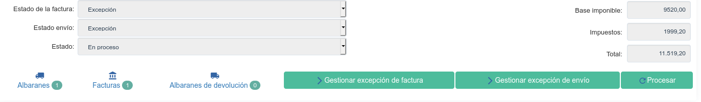
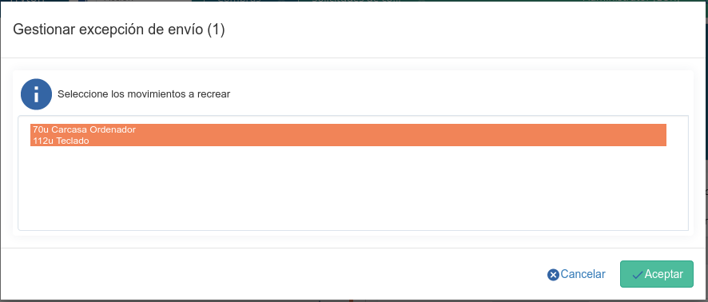

==================
Gestión de Compras
==================

.. inheritref:: purchase/purchase:section:compra

Compra
======

Para crear o listar las ventas accederemos a |menu_purchase|.

.. |menu_purchase| tryref:: purchase.menu_purchase_form/complete_name

.. view:: purchase.purchase_view_form
   :field: party

Una compra está compuesta principalmente por una parte en la que se
define el proveedor con sus datos (a la que llamamos cabecera), y otra parte
compuesta de líneas en la que se definen los productos, la cantidad, etc.

Crear una nueva compra
======================

Lo primero que debemos introducir es el |party|, pudiendo seleccionar uno
existente o crear uno de nuevo directamente desde la venta. Una vez
seleccionado el |party| nos rellenara los datos que conozca del cliente,
cómo por ejemplo la |invoice_address| o el |payment_term|.

.. |party| field:: purchase.purchase/party
.. |invoice_address| field:: purchase.purchase/invoice_address
.. |payment_term| field:: purchase.purchase/payment_term
.. |reference| field:: purchase.purchase/reference

Después podemos introducir la líneas, introduciendo una para cada
|line_product| que queremos comprar. Una vez seleccionado el producto
introducimos la |line_quantity| y podemos guardar la línea.

Mediante el campo |line_type|, podremos definir distintos tipos de línea.
El valor por defecto es Línea, lo que significa que esta línea de pedido de
compra contiene los campos mencionados anteriormente. Los otros valores son
Comentario, Subtotal y Título que se utilizan para añadir líneas extras que
aparecerán en el informe permitiendo de esta forma una personalización más
sencilla.

.. |line_type| field:: purchase.line/type
.. |line_quantity| field:: purchase.line/quantity
.. |line_product| field:: purchase.line/product

.. inheritref:: purchase/purchase:paragraph:la_opcion_de_producto

El |line_product| en una linea del pedido de compra es opcional.Si queremos
que estos productos estén en los albaranes, deberemos seleccionar forzosamente
un producto.

.. inheritref:: purchase/purchase:section:estados

Flujo de compras
================

En la parte inferior izquierda podremos observar en todo momento en qué estado
se encuentra la compra. Los pasos básicos son los siguientes y siguen este
orden::

    Borrador > Presupuesto > Confirmado > En proceso > Finalizado

Mientras estamos introduciendo los datos de la compra, ésta se mantendrá en
estado borrador. De esta forma podemos guardarla y continuar en otro momento y
se mantendrá así hasta que pulsemos el botón Presupuesto momento en el cual
pasará al siguiente estado. Una vez confirmada la compra se rellenará el campo
|reference| con el número de compra que se mantendrá para hacer todo el
seguimiento posterior.

A continuación se detallan los pasos que pasa un pedido de compra:

* **Borrador**: Representa aquellas compra que aún no se han terminado de
  definir.
* **Presupuesto**: Compras sobre las que hemos recibido un presupuesto del
  proveedor pero aún no han sido confirmadas.
* **Confirmado**: Hemos confirmado la compra con el proveedor.
* **Realizada**: Todos los albaranes y facturas relacionados con la compra se
  han generado correctamente.
* **Cancelado**: Compras que han sido canceladas antes de confirmarse.

.. note::
    Hay que tener en cuenta, que una vez confirmadas las compras, estas ya no
    podrán ser modificadas.

Además también podemos saber el estado de la facturación y el estado de los albaranes relacionados con una compra. Los posibles estados son

|invoice_state|
~~~~~~~~~~~~~~~
* **Ninguno**: Todavía no se ha generado ninguna factura relacionada con esta
  compra.
* **En espera**: Se han generado las facturas pero estas en espera de ser
  pagadas.
* **Pagada**: Todas las facturas relacionadas con esta compra han sido pagadas.
* **Excepción**: Se ha producido alguna excepción durante el proceso de
  facturación. En el apartado :ref:`purchase-exceptions` se detalla cómo
  corregir este estado.

|shipment_state|
~~~~~~~~~~~~~~~~
* **Ninguno**: Todavía no se ha generado ningún albarán relacionada con esta
  compra.
* **En espera**: Los albaranes están pendientes de ser procesados.
* **Enviado**: Todos los movimientos relacionados con la compra han sido enviados.
* **Excepción**: Se ha producido alguna excepción durante el proceso de envío
  de los movimientos. En el apartado :ref:`purchase-exceptions` se detalla cómo
  corregir este estado.

.. warning::  Se generan albaranes sólo si las lineas del pedido de compra van
              relacionado con un producto y no sean del tipo servicio.

.. |invoice_state| field:: purchase.purchase/invoice_state
.. |shipment_state| field:: purchase.purchase/shipment_state

.. _purchase-generacion-albaranes-facturas:

Generación de albaranes y facturas
==================================

Una vez confirmada una compra esta nos generará los movimientos de existencias
relacionados, pero no nos creará ningún albarán de proveedor, que deberemos
crear manualmente. De todos modos, en el albarán de proveedor podremos
seleccionar el botón + en los movimientos de entrada para buscar movimientos
pendientes de recibir del proveedor y añadirlos automáticamente al albarán.

El campo |invoice_method| determina en qué momento se generarán las
facturas relacionadas con las compras.  Los métodos posibles son:

* **Manual**: No se generará ninguna factura de forma automática.
* **Al procesar el pedido**: Una vez procesada la compra se generarán un factura con todas las líneas del pedido de compra en estado borrador.
* **Al envío**: Se generará una factura cada vez que se realice el envío de un albarán. Si el albarán no contiene todos los productos de la compra, sólo se facturará aquellos productos que hayan sido recibidos.

Tal cómo se explica en :ref:`purchase-configuration` se pueden definir valores
por defecto para este campo. Además, para cada venta, podremos modificar el
valor del mismo desde la pestaña Información adicional.

.. |invoice_method| field:: purchase.purchase/invoice_method

Facturación parcial
~~~~~~~~~~~~~~~~~~~

Podemos facturar parcialmente una compra simplemente modificando eliminando
las líneas de facturas que no queramos facturar en ese momento, o modificando
las cantidades a facturar. Una vez confirmada la factura, el programa vuelve a
procesar las compras relacionadas, creando (en caso de que sea necesario) una
nueva factura con las líneas pendientes de facturar.

Recepciones parciales
~~~~~~~~~~~~~~~~~~~~~

En caso de que el proveedor nos haya enviado solo una parte del pedido,
simplemente no debemos seleccionar las líneas que no hemos recibido todavía
en el albarán de recepción. Los movimientos pendientes de recibir quedarán en
estado borrador para que los podamos adjuntar en otro albarán cuando los
recibamos.

En caso de recibir menos cantidad de un producto de la que esperamos,
simplemente debemos modificar la cantidad recibida en el albarán y al
confirmarlo se nos crearan los movimientos pendientes para que los podamos
recibir en un futuro albarán.

Devolución de la compra
=======================

En caso de tener que devolver productos a un proveedor podemos crear la compra
con las cantidades negativas. Esto nos generará el correspondiente albarán de
devolución y las facturas de abono de proveedor.

.. _purchase-exceptions:

Gestión de excepciones
======================

Una compra puede estar en excepción por alguno de los siguientes motivos:

* Alguno de sus movimientos de existencias ha estado cancelado.
* Alguna de sus facturas ha estado cancelada.

En ambos casos el responsable de la compra deberá gestionar la excepción, ya
sea volviendo a crear los movimientos/facturas cancelados, o ignorando los
para no volver a generarlos. Esto nos permite una doble validación (por parte
del encargado de realizar los albaranes/facturas, y el encargado de la compra),
para asegurarnos que no se produzca ningún error durante todo el proceso.

Para generar las excepciones debemos utilizar los botones Gestionar excepción
de factura y Generar excepción de facturación, tal como se muestra en la imagen
siguiente:

Excepción de envío
~~~~~~~~~~~~~~~~~~

Una vez pulsado el botón Gestionar excepción de envío, nos aparecerá una
pantalla donde podremos ver los movimientos que causan la excepción cómo se
puede ver a continuación:

Para volver a crear los movimientos pendientes, simplemente debemos pulsar el
botón aceptar. Para ignorar los movimientos, debemos seleccionar los y utilizar
el botón - para eliminarlos. Una vez ignorados (nos aparecerán en gris) los
movimientos estos no se volverán a tener en cuenta para el cálculo del estado
de la compra.

Estos movimientos nos seguirán apareciendo en la pestaña Albaranes de la
compra, pudiendo ver en la misma la acción que se ha realizado al gestionar la
excepción.

Excepción de facturación
~~~~~~~~~~~~~~~~~~~~~~~~

El flujo de excepciones de facturación es muy semejante al flujo de excepciones
de envíos, aunque en vez de seleccionar aquellos movimientos que queremos y
recrear/ignorar, deberemos seleccionar aquellas líneas de factura que queremos
recrear/ignorar.

También podremos ver el histórico de facturas en la pestaña Facturas, de la
compra.

.. _purchase-configuration:

.. inheritref:: purchase/purchase:section:configuracion

Configuración
=============

En |menu_configuration| podemos definir los valores por defecto para el campo
|invoice_method| . En el apartado
:ref:`purchase-generacion-albaranes-facturas` se detalla los valores posibles,
junto con sus implicaciones.

.. |menu_configuration| tryref:: purchase.menu_configuration/complete_name

Además también podremos definir la |conf_sequence| que será la utilizada para
generar el campo |reference|.

.. |conf_sequence| field:: purchase.configuration/purchase_sequence
.. |reference| field:: purchase.purchase/reference
