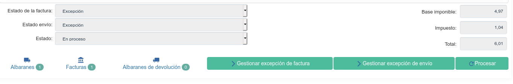

=================
Gestión de Ventas
=================

Es importante tener en cuenta que una Venta es un documento que engloba todo
el proceso desde la presentación de un presupuesto hasta la formalización del
pedido. No debe preocuparnos si el presupuesto no es confirmado por parte del
cliente pues podremos cancelarlo antes de pasarlo a pedido. Tampoco es un
problema si recibimos un pedido directo. En este caso también deberemos
dirigirnos a ventas pero pulsando un botón podremos fácilmente pasar el
documento a pedido formalizado.

.. inheritref:: sale/sale:section:venta

Venta
=====

Para crear o listar las ventas accederemos a |menu_sale|.

.. |menu_sale| tryref:: sale.menu_sale_form/complete_name

.. view:: sale.sale_view_form
   :field: party

Una venta está compuesta principalmente por una parte en la que se define el
cliente con sus datos (que solemos llamar cabecera), y otra parte compuesta
de líneas en la que se definen los productos, la cantidad, etc.

Crear una nueva venta
=====================

Lo primero que debemos introducir es el |party|, pudiendo seleccionar uno
existente o crear uno de nuevo directamente desde la venta. Una vez
seleccionado el |party| nos rellenara los datos que conozca del cliente,
cómo por ejemplo la |invoice_address|, la |shipment_address| o el
|payment_term|.

.. |party| field:: sale.sale/party
.. |invoice_address| field:: sale.sale/invoice_address
.. |shipment_address| field:: sale.sale/shipment_address
.. |payment_term| field:: sale.sale/payment_term

Después podemos introducir la líneas, introduciendo una para cada
|sale_line_product| que queremos presupuestar o vender. Una vez seleccionado
el producto introducimos la |sale_line_quantity| y podemos guardar la línea.

Mediante el campo |sale_line_type|, podremos definir distintos tipos de línea.
El valor por defecto es Línea, lo que significa que esta línea de pedido de
venta contiene los campos mencionados anteriormente. Los otros valores son
Comentario, Subtotal y Título que se utilizan para añadir líneas extras que
aparecerán en el informe permitiendo de esta forma una personalización más
sencilla.

Establecer un producto en un línea del pedido de venta es opcional, de todos
modos, si queremos que estos productos esten en los albaranes, deberemos
seleccionar forzosamente un producto que no sea de tipo servicio.

.. |sale_line_type| field:: sale.line/type
.. |sale_line_quantity| field:: sale.line/quantity
.. |sale_line_product| field:: sale.line/product
.. |sale_line_description| field:: sale.line/description
.. |sale_line_unit_price| field:: sale.line/unit_price
.. |sale_line_amount| field:: sale.line/amount

Flujo de ventas
===============

En la parte inferior izquierda podremos observar en todo momento en qué estado
se encuentra la venta. Los pasos básicos son los siguientes y siguen este
orden::

    Borrador > Presupuesto > Confirmado > En proceso > Finalizado

Mientras estamos introduciendo los datos de la venta, ésta se mantendrá en
estado borrador. De esta forma podemos guardarla y continuar en otro momento y
se mantendrá así hasta que pulsemos el botón Presupuesto momento en el cual
pasará al siguiente estado y se rellenará el campo Referencia con el número de
venta que se mantendrá tanto para el presupuesto como para el pedido así como
para hacer todo el seguimiento posterior.

A continuación se detallan los pasos que pasa un pedido de venta:

* **Borrador**: Representa aquellas ventas que aún no se han terminado de
  definir.
* **Presupuesto**: Ventas sobre las que hemos presentado un presupuesto al
  cliente però aún no tenemos respuesta.
* **Confirmado**: El cliente nos ha confirmado la venta, però aún no se ha
  iniciado la preparación de la misma.
* **En proceso**: Se pasa al departamento de almacén y producción. A partir de
  este momento el sistema ya conoce de la necesidad de servir el producto y
  puede empezar a planificar producciones y compras si son necesarias.
* **Realizada**: Todos los albaranes y facturas relacionados con una venta se
  han generado correctamente.
* **Cancelado**: Ventas que han sido canceladas antes de confirmar-se.
  Típicamente se tratará de presupuestos no aprobados por el cliente.

.. note::
    Hay que tener en cuenta, que una vez confirmadas las ventas, estas ya no
    podrán ser modificadas.

Además también podemos saber el estado de las facturas relacionadas
mediante el campo |invoice_state| y el estado de los alabaranes relacionados
mediante el campo |shipment_state|. Los posibles estados son:

|invoice_state|
~~~~~~~~~~~~~~~
* **Ninguno**: Todavía no se ha generado ninguna factura relacionada con esta
  venta.
* **En espera**: Se han generado las facturas pero estas en espera de ser
  pagadas.
* **Pagada**: Todas las facturas relacionadas con esta venta han sido pagadas.
* **Excepción**: El sistema había generado una factura pero un usuario ha
  cancelado la factura. En el apartado :ref:`sale-exceptions` se detalla cómo
  corregir este estado.

|shipment_state|
~~~~~~~~~~~~~~~
* **Ninguno**: Todavía no se ha generado ningún albarán relacionada con esta
  venta.
* **En espera**: Los albaranes están pendientes de ser procesados.
* **Enviado**: Todos los movimientos relacionados con la venta han sido
  enviados.
* **Excepción**: Como en el caso de las facturas, el sistema había generado un
  albarán para su salida pero un usuario ha cancelado el albarán (o algunas
  de sus líneas). En el apartado :ref:`sale-exceptions` se detalla cómo
  corregir este estado.

.. warning::  Se generan albaranes sólo si las linias del pedido de venta van
              relacionado con un producto y no sean del tipo servicio.

En el apartado :ref:`sale-exceptions` se detalla cómo generar el estado de
excepción.

.. |invoice_state| field:: sale.sale/invoice_state
.. |shipment_state| field:: sale.sale/shipment_state

.. _sale-generacion-albaranes-facturas:

Generación de albaranes y facturas
==================================

Los campos |invoice_method| y |shipment_method| determinan, respectivamente,
en qué momento se generarán las facturas y los albaranes relacionados con las
ventas. Los métodos posibles son:

|invoice_method|
~~~~~~~~~~~~~~~~

* Manual: No se generará ninguna factura de forma automática.
* Al procesar el pedido: Una vez procesada la venta se generarán un factura
  con todas las líneas del pedido de venta en estado borrador.
* Al envío: Se generará una factura cada vez que se realice el envío de un
  albaran. Si el albarán no contiene todos los productos de la venta, sólo se
  facturarán aquellos productos que hayan sido enviados.

|shipment_method|
~~~~~~~~~~~~~~~~~
* Ninguno: No se generará ningún albarán de forma automática
* Al procesar el pedido: Una vez procesada la venta se generará un albarán con
  todos los movimientos de existencias necesarios.
* Al pagar la factura: Se generarán los albaranes de aquellos productos que
  sus respectivas facturas hayan sido pagados.

Tal cómo se explica en :ref:`sale-configuration` se pueden definir valores
por defecto para estos campos. Además, para cada venta, podremos modificar el
valor de los mismos desde la pestaña Información adicional.

.. |invoice_method| field:: sale.sale/invoice_method
.. |shipment_method| field:: sale.sale/shipment_method

En :ref:`stock-partial-shipments` se detalla el proceso  necesario para
realizar envios parciales dentro de una misma venta.

.. inheritref:: sale/sale:section:devolucion_venta

Devolución de la venta
======================

En el caso de realizar una venta, se ha procesado y finalmente se debe abortar
la entrega dispone de un asistente en el menú de acciones para hacer para hacer
una devolución de la venta.

La acción devolución de la venta simplemente creará una nueva copia de la venta
origen pero con la diferencia que las cantidades de las líneas serán ahora en
negativo.

Si las cantidades de las líneas de la venta son en negativo, en el momento de
procesar el albarán en vez de crear un albarán de cliente, se creará un albarán
de abono de cliente y en el momento de generar la factura en vez de crear una
factura de cliente se creará un abono.

.. note::
    Se pueden mezclar lineas con cantidades positivas y negativas en una misma
    venta. En este caso, se generarn albaranes y facturas para las líneas
    con cantidades positivas y albaranes de devolucion y abonos para las
    negativas.

Realizar una venta en distinta divisa
=====================================

Por defecto todas las ventas se realizan en la moneda de la compañia, aunque
es possible realizar ventas en una moneda distinta.

En caso de que tengamos clientes que nos compren en una divisa específica,
podemos utilizar el campo |currency| para determinar la divisa a utilizar para
la venta. Esto provocará que los precios de los productos se conviertan a la
moneda que hemos seleccionado de forma automàtica.

.. |currency| field:: sale.sale/currency

.. _sale-exceptions:

Gestión de excepciones
======================

Una venta, puede estar en excepción ya por alguno de los siguientes motivos:

* Alguno de sus movimientos de existèncias ha estado cancelado.
* Alguna de sus facturas ha estado cancelada.

En ambos casos, el responsable de la venta deberá indicar cómo se va a
gestionar esa excepción. Esto nos permite una doble validación (por parte del
encargado de realizar los albaranes/facturas, y el encargado de la venta),
para asegurarnos que no se produzca ningún error durante todo el proceso.

Para generar las excepciones debemos utilizar los botones Gestionar excepción
de factura y Generar excepción de facturación, tal como se muestra en la
imagen siguiente.

Excepción de envío
~~~~~~~~~~~~~~~~~~

Una vez pulsado el botón Gestionar excepción de envío, nos aparecerá una
pantalla donde podremos ver los movimientos que causan la excepción cómo se
puede ver a continuación

.. figure:: images/sale-exception-moves.png

Para volver a crear los movimientos pendientes, simplemente debemos pulsar el
botón aceptar. Para ignorar los movimientos, debemos seleccionarlos y utilizar
el botón - para eliminarlos. Una vez ignorados (nos aparecerán en gris)
los movimientos estos no se volverán a tener en cuenta para el cálculo del
estado de la venta.

Estos movimientos nos seguirán apareciendo en la pestaña Albaranes de la venta,
pudiendo ver en la misma la acción que se ha realizado el generar la excepción.

Excepción de facturación
~~~~~~~~~~~~~~~~~~~~~~~~

El flujo de excepciones de facturación es muy semejante al flujo de excepciones
de envíos, aunque en vez de seleccionar aquellos movimientos que queremos
recrear/ignorar, deberemos seleccionar aquellas líneas de factura que queremos
recrear/ignorar.

También podremos ver el històrico de facturas en la pestaña Facturas de la
venta.

.. _sale-configuration:

.. inheritref:: sale/sale:section:configuracion

Configuración
=============

En |menu_configuration| podemos definir los valores por defecto para los campos
|invoice_method| y |shipment_method|. En el apartado
:ref:`sale-generacion-albaranes-facturas` se detalla los valores posibles,
junto con sus implicaciones.

.. |menu_configuration| tryref:: sale.menu_configuration/complete_name

Además tambien podremos definir la |conf_sequence| que será la utilizada para
generar el campo |reference|.

.. |conf_sequence| field:: sale.configuration/sale_sequence
.. |reference| field:: sale.sale/reference
