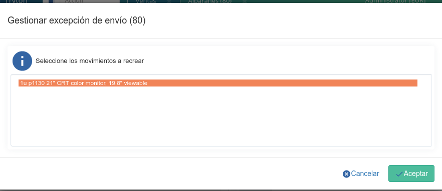

=================
Gestión de Ventas
=================

En **Tryton** el concepto *Venta* no se limita únicamente la venta en sí, sino
que engloba todo el proceso que se llevará a cabo: desde la presentación de un
presupuesto hasta la formalización del pedido. Todo ello se gestiona en un
mismo documento que irá cambiando de estado según vaya avanzando el proceso de
la venta. En primer lugar veremos como crear una venta nueva y posteriormente
profundizaremos en los distintos estados en los que podemos encontrar la venta.

Crear una nueva venta
=====================

Al acceder a ventas se nos abrirá una pestaña con un listado de las ventas
que hemos ido introduciendo con anterioridad clasificadas según el estado en
el que se encuentran (*Borrador*, *Presupuesto*, *Confirmado*, *En proceso*).
Además, también podremos ver un listado con todas las ventas realizadas,
independientemente de su estado, desde la subpestaña *Todo* (más adelante, en
:ref:`Flujo de ventas <estados-venta>` veremos más detenidamente cada uno de
los estados en los que nos podemos encontrar una venta). Haciendo doble clic
sobre cualquier venta del listado accederemos a su información concreta y
detallada. Si lo que queremos es crear una venta nueva deberemos clicar sobre
el icono *Nuevo* y se nos abrirá el formulario de edición con los campos que
deberemos rellenar para crear la venta.

.. view:: sale.sale_view_form
   :field: party

   Captura de pantalla de una venta

La venta está compuesta por una parte en la que se define el cliente con sus
datos (Cabecera), y otra compuesta por varias pestañas que contendrán
información concreta sobre la venta en sí. En la cabecera, una vez indiquemos
el tercero se rellenarán automáticamente los campos dirección de facturación y
dirección de facturación con la información que tengamos en la ficha del tercero,
pudiéndolos modificar si lo deseamos.

Además, para calcular el precio del coste de envío, deberemos indicar el
transportitsta que realizará la entrega y el método de coste envío en la pestaña
**Información adicional**. En el momento de seleccionar un transportista también se
generará una nueva línea en el pedido de venta con el coste y producto del
envío. Cada vez que cambie una línea (ya sea el producto, precio o cantidad)
esta línea se generará de nuevo. En el caso que sea un pedido que ya se haya
guardado, se eliminará la línea creando una de nueva.

En la pestaña **Venta** podremos indicar la fecha venta, el almacén  desde
donde se realiza la venta, la moneda y el palzo de pago. Estos dos últimos
campos también se rellenarán automáticamente con la información que tengamos
del tercero en su ficha.

Por último, tendremos que rellenar el campo línias con la información de los
productos que serán objeto de la venta, creando tantas líneas como productos
distintos vayamos a vender o presupuestar. Para generar una línea clicaremos en
el icono *Nuevo* del campo línias y se nos abrirá un ventana emergente con los
siguientes campos:

 * Tipo: Mediante este campo podremos definir distintos tipos de línea.
   El valor por defecto es *Línea*, si mantenemos este tipo deberemos
   rellenar también los campos que siguen a este en la explicación. Los otros
   valores son *Comentario*, *Subtotal* y *Título* que se utilizan para añadir
   líneas extras que aparecerán en el informe permitiendo de esta forma una
   personalización más sencilla. Estos últimos tres tipos se componen
   únicamente de los campos descripción y sequencia.
 * Product: Aquí seleccionaremos el producto que queremos vender o
   presupuestar. Establecer un producto es opcional, de todos modos, si
   queremos que estos productos estén en los albaranes y se hagan los
   correspondientes movimientos de stock, deberemos seleccionar forzosamente
   un producto que no sea de tipo servicio.
 * Descripción: En este campo reflejaremos aquello que aparecerá
   como descripción de la línea en la venta. Si indicamos previamente el
   producto , este campo se rellenará automáticamente con el nombre
   del producto, aunque podremos modificarlo.
 * Cantidad  y unidad: Indicaremos la cantidad y la unidad de
   medida del producto que estamos introduciendo.
 * Precio unidad: Cuando indiquemos (o se nos rellene el campo con la
   información introducida en la ficha del producto) el precio por unidad al
   que vendemos el producto, se nos rellenará de forma automática el campo
   importe con el total de la línea.
 * Impuestos: Si tenemos configurados los productos con el impuesto que
   les corresponde, este campo se nos rellenará automáticamente con la
   información indicada en el producto, si no, deberemos indicar qué impuesto
   gravará la línea de la venta.

.. _generacion-albaranesfacturas:

Si accedemos a la pestaña **Información adicional** podremos indicar en los
campos método de facturación y el método de envío en qué punto de la venta
queremos que se genere la factura, y cuándo queremos que se realice el envío de
la mercancía. Para el campo método de facturación podremos elegir entre:

* *Manual*: No se generará ninguna factura de forma automática y tendremos que
  generar nosotros la factura de forma manual.
  (:ref:`Cómo generar una factura manualmente<gestion-facturas>`).
* *Al procesar el pedido*: Una vez la venta cambia a estado *En proceso* se
  generará un factura con todas las líneas del pedido de venta en estado
  borrador.
* *Al enviar*: Se generará una factura cada vez que se realice el envío de un
  albarán. Si el albarán no contiene todos los productos de la venta, sólo se
  facturarán aquellos productos que hayan sido enviados.

En el campo método de envio podremos elegir entre:

* *Manual*: No se generará ningún albarán de forma automática y tendremos que
  generar nosotros el movimiento de stock
  (:ref:`Cómo generar una albarán manualmente<gestion-envios>`).
* *Al procesar el pedido*: Una vez cambie el estado de la venta a *En proceso*
  se generará un albarán con todos los movimientos de existencias necesarios.
* *Al pagar la factura*: Se generarán los albaranes de aquellos productos que
  en sus respectivas facturas hayan sido pagados.

Como se indica en el apartado :ref:`Configuración<sale-configuration>`, podemos
configurar los métodos por defecto que se mostrarán en las ventas.

Desde las pestañas **Facturas** y **Albaranes** podremos acceder a la
información sobre los envíos y facturación de la venta. Una vez se generen los
albaranes o facturas, nos aparecerán en sus respectivas pestañas y podremos
acceder a la información concreta de cada documento. En :ref:`venta-estados-fac-alb`
se indica en qué estados nos podemos encontrar estos dos documentos.

Envios directos
===============

.. toctree::
   :maxdepth: 2

   ../../../sale_supply_drop_shipment/doc/es/sale_supply_drop_shipment

Flujo de ventas
===============

.. _estados-venta:

En la parte inferior izquierda de la venta podremos observar en todo momento
en qué estado se encuentra esta. Una venta siempre pasará por los mismos pasos,
y seguirá el siguiente orden::

    /Borrador > Presupuesto > Confirmada > En proceso > Realizada/
                            > Cancelada/

Siempre que generamos una venta nueva se nos creará en estado **Borrador** ya
que es el único estado que permite la edición de los campos. Representan
aquellas ventas que todavía no se han acabado de definir. Podemos dejarla
guardada en este estado hasta el momento que consideremos oportuno o clicar
en el botón *Presupuesto* para cambiar el estado de la venta.

Una vez tengamos la venta en estado **Presupuesto** se rellenará
automáticamente el campo referencia según la secuencia que le hayamos indicado
en la :ref:`Configuración<sale-configuration>` de la venta. Representa que le
hemos presentado un presupuesto a nuestro cliente pero este todavía no nos ha
dado una respuesta sobre él. Una vez nos conteste nuestro cliente, podemos
cambiar el estado de la venta según su respuesta sea afirmativa o negativa por
medio de los botones *Cancelar* y *Confirmar*. Además, si queremos añadirle
cualquier modificación, podremos hacerlo clicando en el botón *Borrador*, lo
que cambiará la venta a este estado.

Si la respuesta de nuestro cliente es negativa, al clicar en el botón
*Cancelar*, el estado de la venta pasará a **Cancelada**.

Si nuestro cliente nos confirma el presupuesto, podremos cambiar el estado de
la venta a **Confirmado**. Con ello indicamos que el cliente ha aceptado
nuestro presupuesto, pero que la venta todavía no se ha procesado. Tenemos que
tener presente que una vez confirmada la venta, no la podremos cancelar ni
podremos hacer que esta pase a un estado anterior. Podremos dejar la venta en
estado **Confirmado** hasta el momento en el que comencemos a procesar la
venta, cuando le deberemos dar al botón *Procesar* para cambiar su estado.

Con el estado **En proceso** la gestión de la venta pasa al departamento de
logística o al de producción, por lo que será el último paso que realizaremos
desde la pestaña ventas. A partir de este momento, el sistema ya conoce de la
necesidad de servir el producto y puede empezar a planificar producciones o
compras si son necesarias.

En el momento en el que, desde los departamentos correspondientes, se le
indique al sistema que se ha realizado el pago de la factura y el envío de la
mercancía, el estado de la venta cambiará a **Realizada** y el proceso de venta
se habrá completado.

.. _venta-estados-fac-alb:

Estado de factura y estado de envio
~~~~~~~~~~~~~~~~~~~~~~~~~~~~~~~~~~~~

Como hemos comentado anteriormente, desde las pestañas **Facturas** y
**Albaranes** veremos en todo momento el estado en el que se encuentran
las facturas y envíos generados por la venta, estos estados pueden ser:

* Estado de la factura

  * *Ninguno*: Todavía no se ha generado ninguna factura relacionada con esta
    venta.
  * *En espera*: Las facturas relacionadas con esta venta se han generado pero
    están a la espera de ser gestionadas y pagadas.
  * *Pagada*: Todas las facturas relacionadas con esta venta han sido pagadas.
  * *Excepción*: El sistema había generado una factura pero un usuario ha
    cancelado la factura. En el apartado :ref:`sale-exceptions` se detalla cómo
    corregir este estado.

* Estado envío

  * *Ninguno*: Todavía no se ha generado ningún albarán relacionado con esta
    venta.
  * *En espera*: Los albaranes están pendientes de ser procesados.
  * *Enviado*: Todos los movimientos relacionados con la venta han sido
    enviados.
  * *Excepción*: Como en el caso de las facturas, el sistema había generado un
    albarán para su salida pero un usuario ha cancelado el albarán (o algunas
    de sus líneas). En el apartado :ref:`sale-exceptions` se detalla cómo
    corregir este estado.

.. note:: Los albaranes de envío únicamente se generarán si realizamos la venta
   sobre un producto clasificado como *Bien* o como *Activo*, por lo que si la
   venta se realiza sobre un servicio solamente se generarán las facturas.

Devolver o cancelar una venta una vez confirmada
================================================

En el caso de realizar una venta que, una vez procesada, se deba abortar, lo
gestionaremos por medio de un asistente habilitado a tal efecto. Para ello,
dentro de la venta que queremos devolver, clicaremos en el menú *Ejecutar
acción* y clicaremos en *Devolución venta*. Esto creará una copia de
la venta que estamos devolviendo, pero con la diferencia que las cantidades
de las líneas estarán ahora en negativo.

Al estar las líneas de la venta en negativo, en el momento de procesar el
albarán en vez de crear un albarán de cliente, se creará un albarán de
devolución de cliente y en el momento de generar la factura, en vez de crear
una factura de cliente se creará una factura de abono.

.. note::
    Se pueden mezclar lineas con cantidades positivas y negativas en una misma
    venta. En este caso, se generaran albaranes y facturas para las líneas
    con cantidades positivas y albaranes de devolución y abonos para las
    negativas.

Realizar una venta con distinta divisa
======================================

En caso de que tengamos clientes que nos compren con una divisa distinta a la
que tenemos configurada por defecto (y con la que realizamos toda la actividad
contable), podemos indicarlo en el campo moneda de la venta. Esto provocará
que cuando seleccionemos el producto en la línea de venta, el precio que se
indica en el campo precio unidad refleje ya la conversión a la moneda
indicada según la tasa de cambio informada para la fecha de la venta (podemos
acceder a :ref:`gestion-moneda` para ver cómo configurar las tasas de cambio de
las monedas extranjeras).

.. warning:: El sistema no recalcula el precio de líneas de venta si estas las
   hemos generado antes de escoger la moneda. Por lo que si queremos que haga
   la conversión de una línea ya introducida deberemos borrarla y volverla a
   crear.

Todo el proceso de la venta se realizará con la moneda indicada y una vez
nuestro cliente realice el pago, y nosotros lo informemos en el sistema,
**Tryton** realiza una nueva conversión a nuestra divisa con la tasa de cambio
en el momento del pago.

Por lo tanto, es cuando se genera el asiento del pago de una factura cuando el
sistema realiza el cambio definitivo de divisa y refleja la cantidad en nuestra
propia divisa. Así pues, si un cliente inglés nos pide un presupuesto en
libras, todo el proceso de venta se realizará en libras (borrador, presupuesto,
confirmación y procesado) según la tasa de cambio existente en el momento de
generar la venta. Cuando este cliente nos realice el pago en libras, el sistema
calculará de nuevo la conversión de las libras a euros según la tasa en el
momento del pago y una vez convertido el importe a euros realiza el asiento en
el diario correspondiente en euros.

.. note:: En caso de que hubiese diferencias en la tasa de cambio del día de
   venta y la del día de pago, el sistema genera un asiento adicional en la
   cuenta contable *Diferencias negativas de cambio (668)* o *Diferencias
   positivas de cambio (768)* reflejando las diferencias o desajustes en el
   cambio de divisa.

.. _sale-exceptions:

Excepciones en la venta
=======================

Aunque no es muy frecuente, es posible que se dé el caso de que cuando
procesemos una venta, y se generen los correspondientes documentos (facturas
y/o albaranes), desde el departamento correspondiente nos cancelen alguno
de estos documentos (porque haya un error en la venta, un descuadre de stock,
etc.). A este hecho **Tryton** lo llama *Excepción*. Cuando esto suceda,
seremos nosotros, desde *Ventas*, los encargados de gestionar esta excepción,
confirmando la cancelación y, por lo tanto, modificando el documento, o
volviendo a emitir el mismo documento si la cancelación no se debiera de haber
producido. Esto nos permite una doble validación: por un lado del encargado de
realizar los albaranes o facturas que cancela el documento; y por el otro lado,
nosotros que, como responsables de la venta, tendremos que confirmar esta
excepción.

Cuando esto suceda, y nos cancelen algún documento, desde la venta podremos ver
como el estado del documento cambia a *Excepción*. Además, en la parte inferior
derecha de la venta nos aparecerán los botones "Gestionar excepción de factura"
y/o "Gestionar excepción de envío" (dependiendo de si nos han cancelado un
albarán, una factura o ambos documentos) desde donde llevaremos a cabo la
gestión de la excepción.

.. figure:: images/sale-exceptions.png

   Captura de pantalla de las excepciones

Gestión de la excepción
~~~~~~~~~~~~~~~~~~~~~~~

El procedimiento para gestionar una excepción será el mismo tanto si nos
cancelan un albarán como una factura. Para la *excepción de factura* tendremos
que indicar qué facturas se generarán de nuevo (en caso de que haya más de una),
y para la *excepción de envío* tendremos que indicar los productos que
incluiremos en el nuevo albarán. Para llevar a cabo la gestión, clicaremos en
el botón *Gestionar excepción de envío* o *Gestionar excepción de factura* y
nos aparecerá una ventana dónde podremos ver los movimientos (si se trata del
envío) o las facturas (si se trata de la factura) que causan la
excepción, o dicho de otro modo, los movimentos o facturas  que han sido
cancelados.

   Captura de pantalla de los movimientos a recrear

Será desde esta ventana dónde podremos seleccionar los productos que
queremos que se incluyan en el nuevo albarán, o las facturas que queremos que
se vuelvan a crear. Por defecto, cuando se abra la ventana, aparecen todos los
productos seleccionados, si clicamos sobre alguno de ellos los
deseleccionaremos, y si clicamos de nuevo, los volveremos a seleccionar. Una
vez seleccionemos los productos o facturas clicaremos en aceptar y se nos
generará un nuevo albarán con los productos seleccionados (si gestionábamos la
excepción de envío) o se nos generarán de nuevo las facturas seleccionadas (si
lo hacíamos sobre la excepción de factura). En caso de que no seleccionemos
nada, no se generará ningún documento nuevo.

Si hemos gestionado una excepción de envío y posteriormente accedemos a la
pestaña **Albaranes** de la venta, veremos que el albarán original nos aparece
en estado *Cancelado* y el nuevo albarán en estado *En espera*. Además, los
movimeinetos originales aparecerán también en estado *Cancelado* y en la columna
estado excepción nos indicará si el producto se ha vuelto a utilizar en
el nuevo albarán (con el estado *Recreado*) o si no lo ha hecho (con el estado
*Ignorado*).

Si la gestión la hemos hecho sobre la factura, podremos acceder posteriormente
a la pestaña **Facturas** y nos aparecerán un listado con las facturas que se
han generado por medio de la venta a modo de histórico. De ellas, la que hayan
provocado la excepción estarán en estado *Cancelado* y las que hayamos generado
de nuevo en el estado concreto en el que se encuentren (*Borrador*, *Validada*
o *Confirmada*).

Iniciativas y oportunidades comerciales
=======================================

.. toctree::

   ../../../sale_opportunity/doc/es/sale_opportunity

Configuración
=============

.. _sale-configuration:

En configuración podemos definir los valores por defecto para los campos
método de facturación y método de envío. En el apartado
:ref:`Métodos de facturación y envío<generacion-albaranesfacturas>` se detalla
los valores posibles, junto con sus implicaciones. Además también podremos
definir la secuencia de venta que será la utilizada para generar el campo
referencia.
