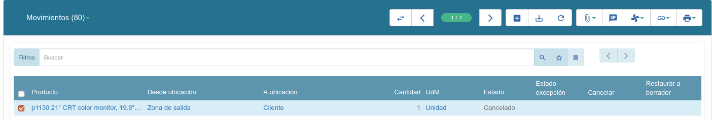

#:inside:stock/stock:section:envio-de-mercaderia#

Albaranes creados desde ventas
~~~~~~~~~~~~~~~~~~~~~~~~~~~~~~

Al confirmar una venta que contengan productos de tipo Bienes automáticamente
se nos creará un albarán de cliente en estado en espera. Este albarán i
contendrá en los movimientos de salida todos los movimientos generados por la i
venta y en los movimientos de inventario los movimientos necesarios para
satisfacer los movimientos de salida.

.. _stock-partial-shipments:

Entregas parciales
~~~~~~~~~~~~~~~~~~

Para que las entregas parciales funcionen correctamente los albaranes de
cliente deben haber sido creados a través de una venta, ya que a través de la
misma el sistema podrá saber cuales son las cantidades de cada producto que
todavía están pendientes de enviar.

En caso de que no haya suficiente stock de algún producto, podemos hacer una
entrega parcial. Para ello, debemos eliminar las líneas en estado borrador de
las líneas de inventario. Una vez eliminadas, podemos reservar el albarán ya
que todos los movimientos estarán reservados. Cuando se realice el envío se
actualizarán las cantidades de los movimientos de salida, reflejando las
cantidades realmente asignadas.

Una vez realizado el albarán, se generará un nuevo albarán en estado En espera
con los movimientos pendientes de realizar. Podremos ver todas los movimientos
y albaranes generados desde la pestaña Albaranes de la venta relacionada, tal
como se muestra a continuación:

Desde allí podemos ver los movimientos pendientes, aquellos con estado Borrador,
junto con los albaranes pendientes, aquellos con estado En espera.

