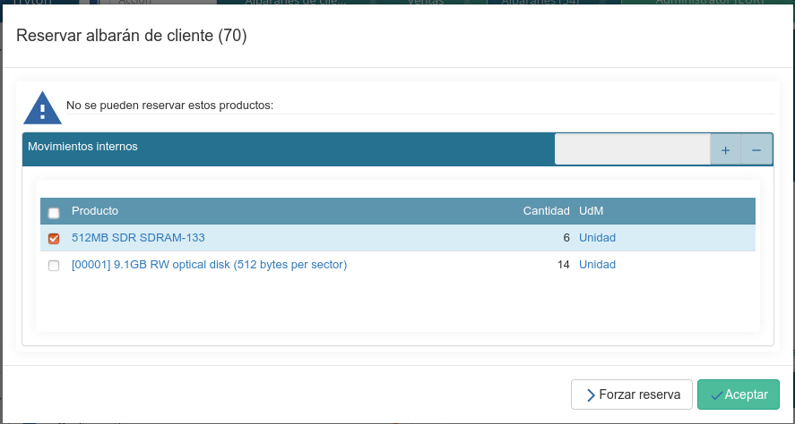

.. _intro-logística:

=============================
Logística y gestión del stock
=============================

Por medio de la sección *Logística* modificamos y variamos la cantidad de stock
de nuestros almacenes, gestionamos la entrada y salida de material y también
los movimientos internos de stock que podamos realizar. Además podremos
realizar e introducir inventarios o configurar y gestionar las ubicaciones y
almacenes donde se encuentran nuestros productos.
Pero antes de ver cómo realizar todo esto, sería aconsejable entender bien el
funcionamiento interno del sistema con la gestión del stock.

Cuando le indicamos al sistema que empezamos a disponer de
un nuevo producto en nuestros almacenes, **Tryton** no lo genera de la nada,
sino que llega a nuestro almacén por medio de un movimiento de stock desde una
ubicación virtual.
Lo mismo sucede, pero a la inversa, cuando nos deshacemos de un producto
(ya sea por una venta, pérdida, robo, etc.), el sistema no hace que este
desaparezca sin más de su ubicación, en vez de esto, realiza un movimiento de
stock hacia una ubicación virtual configurada a tal efecto. De esta forma se
puede llevar un control más eficiente de nuestros materiales.

.. inheritref:: stock/stock:paragraph:ubicaciones-internas

Ejemplificando lo anteriormente descrito, si realizamos una compra, en vez
de aparecer de la nada en nuestro almacén, el sistema realizará un
movimiento desde la ubicación virtual *Proveedor* hacia nuestra ubicación
*Almacén*. De la misma forma, si realizamos una venta, el sistema hará
un movimiento de stock con el producto vendido desde nuestro almacén hasta
la ubicación virtual *cliente*. En caso de perder o encontrar algún producto
que no teníamos contabilizado, el funcionamiento es el mismo pero con la
ubicación virtual *perdido/encontrado*. Toda pérdida se registrará como un
movimiento de stock desde nuestro almacén hasta la ubicación
*perdido/encontrado*, y si encontramos algún producto que no teníamos
inventariado, el registro de este nuevo material se realizará con un
movimiento de la ubicación *perdido/encontrado* hacia nuestro almacén.

.. inheritref:: stock/stock:section:recepcion_mercaderia

Recepción de mercancía
======================

La recepción de mercancía se gestiona por medio de los albaranes de proveedor.
Estos albaranes de entrada nos servirán para dos cosas: en primer
lugar, permite introducir en el sistema la información que nos envía nuestro
proveedor, y, por otro lado, es el medio por el que se le indica al sistema la
llegada de mercancía a nuestros almacenes. Cuando generemos un nuevo albarán de
proveedor, el sistema incrementará las cantidades de productos que le
indiquemos en él.

Antes de ver como crear un nuevo albarán tenemos que saber que los albaranes
de proveedor están formados por dos tipos de movimientos:

* |in_incoming_moves|: Son movimientos desde la ubicación virtual *Proveedor*
  hasta la ubicación configurada como *Zona de entrada* del almacén.
  Representan la recepción real de los productos del proveedor en nuestro
  muelle de descarga.

* |in_inventory_moves|: Son movimientos internos de stock desde la ubicación
  configurada como *Zona de entrada* hasta la configurada como *Zona de
  almacenamiento*. Representan los movimientos desde nuestro muelle de descarga
  hasta su ubicación definitiva donde almacenaremos los productos recibidos.

Deberemos tener en cuenta también que el abarán tendrá un estado distinto
dependiendo del punto en el que se encuentre la recepción del material. A
continuación veremos como crear un nuevo albarán de proveedor y dividiremos el
proceso según el estado en el que se pueda encontrar el albarán:

**Borrador**: Siempre que generemos un albarán este se creará en estado
borrador. Para ello deberemos acceder por medio |menu_shipment_in_form| e
introducir el |in_supplier| y el |in_warehouse| en la pestaña que se nos
abrirá. Una vez introducidos estos datos, podremos indicar todos los
|in_incoming_moves|, especificando en ellos los productos que estamos
recibiendo.

**Recibido**: Una vez introducidos todos los productos, pulsamos sobre el
botón *Recibir* para hacer efectivos todos los |in_incoming_moves|
indicados. Además, se generarán automáticamente los |in_inventory_moves| en
estado *borrador*, por lo que si lo deseamos podremos modificar los campos
de estos últimos movimientos. Al hacerse efectivos los |in_incoming_moves|
el sistema realizará un movimiento de stock desde la ubicación virtual
*Proveedor* hasta la ubicación configurada como *Zona de entrada* del almacén.

**Realizado**: Por último podemos finalizar la recepción mediante el botón
*Realizado*, indicándole al sistema que la mercancía ha sido recibida y
almacenada en su lugar definitivo. El sistema confirmará los
|in_inventory_moves| realizando un movimiento de stock desde la
ubicación configurada como *Zona de entrada* hasta la configurada como
*Zona de almacenamiento* y el estado del albarán cambiará a *Realizado*.

.. note::
   En caso de que necesitemos introducir la recepción de una mercancía que se
   haya realizado en el pasado, mientras el albarán se encuentre en estado
   *Borrador* podemos introducir la fecha en la que se hizo
   efectiva la recepción en el campo |in_effective_date|.
   Así los productos de la recepción constarán, a todos los efectos, en
   nuestros almacenes desde la fecha indicada.

Cancelar albaranes
------------------

En cualquier momento del flujo podremos cancelar los albaranes. Cancelar un
albarán implica cancelar todos los movimientos (tanto los internos como
los de entrada) que están en estado borrador o reservado. Los movimientos que
ya están realizados no se pueden cancelar, por lo que si cancelamos el albarán
una vez recibida la mercancía, el sistema no anulará el movimiento de entrada
ya realizado.

Una vez cancelado un albarán este puede volver a estado borrador utilizando el
botón *Borrador*.

.. note::
   En caso de no haber recibido nunca la mercancía y haber indicado en el
   albarán que esta ha sido recibida, para que el sistema deje de contabilizar
   los productos indicados en el albarán cancelado, deberemos hacer una
   devolución de mercancía como si se tratase de una devolución normal.

Devolución de mercancía recibida
--------------------------------
Para devolver una mercancía que hemos recibido debemos crear un albarán de
devolución de proveedor desde la opción |menu_shipment_in_return_form|.
Al igual que un albarán de proveedor, un albarán de devolución puede estar
en varios estados dependiendo del estado en el se se encuentre la devolución
física del producto:

**Borrador**: Será el estado inicial siempre que creemos un nuevo albarán de
devolución. En primer lugar debemos introducir la ubicación desde donde vamos
a devolver los productos en el campo |in_return_from_location| y la ubicación
donde vamos a enviar los productos en el campo |in_return_to_location| (por
defecto *Proveedor*). Una vez introducidos los campos anteriores podemos
indicar en |in_return_moves| los productos que vamos a devolver a nuestro
proveedor.

**Esperando**: Una vez introducidos los productos podemos clicar en el botón
*Esperando*. Este estado indica que estamos a la espera de que la mercancía
esté disponible en la ubicación desde donde vamos a realizar la devolución.
Si está todo correcto y queremos reservar el material, clicaremos en el botón
*Reservar* para hacer efectiva la reserva. En caso de que no haya suficientes
stock en la ubicación para satisfacer todos los movimientos, el sistema nos
mostrará el siguiente aviso:

   Captura de pantalla del aviso por falta de stock

Podremos visualizar de cada producto las cantidades que no se pueden
reservar porque no hay suficiente stock. Si tenemos los permisos
necesarios nos aparecerá también el botón *Forzar reserva*, que nos
permitirá asignar igualmente los movimientos aunque no haya stock suficiente.
Para continuar sin forzar la reserva clicamos en *Aceptar* y el aviso
desaparecerá volviendo a la pestaña del albarán. Si hacemos esto el albarán
quedará en estado *En espera*, con los movimientos que se hayan podido reservar
en estado *Reservado*, y los movimientos para los que no había stock,
pendientes de reservar y en estado *Borrador*. Podemos cancelar las reservas
parciales utilizando el botón *Borrador* (hará que todo el albarán, incluidos
los movimientos reservados, vuelvan a estado borrador).

En caso de disponer de suficiente stock en la ubicación el estado del albarán
cambiará a estado *Reservado*.

**Reservado**: Con este estado el sistema entiende que el material a
devolver está reservado, por lo que no dejará realizar ninguna acción sobre
él. En otras palabras, el sistema *bloquea* cualquier acción futura sobre la
cantidad reservada para que con ella no se puedan realizar otros movimientos
de stock que no sean la devolución en sí.

**Realizado**: Cuando clicamos en *Realizado* le indicamos al sistema que la
mercancía ha sido entregada al proveedor y por lo tanto ya no disponemos de
ella.

.. |menu_shipment_in_form| tryref:: stock.menu_shipment_in_form/complete_name
.. |menu_shipment_in_return_form| tryref:: stock.menu_shipment_in_return_form/complete_name
.. |in_effective_date| field:: stock.shipment.in/effective_date
.. |in_supplier| field:: stock.shipment.in/supplier
.. |in_warehouse| field:: stock.shipment.in/warehouse
.. |in_incoming_moves| field:: stock.shipment.in/incoming_moves
.. |in_inventory_moves| field:: stock.shipment.in/inventory_moves
.. |in_return_from_location| field:: stock.shipment.in.return/from_location
.. |in_return_to_location| field:: stock.shipment.in.return/to_location
.. |in_return_moves| field:: stock.shipment.in.return/moves

.. _gestion-envios:

Envío de mercancía
==================

De la misma forma que los albaranes de proveedor le indican al sistema cuando
debe introducir qué producto, los albaranes de cliente funcionan como albaranes
de salida que le indicarán al sistema cuando dejamos de disponer de un producto
que se encuentra en nuestros almacenes. Para gestionar estos albaranes deberemos
acceder al menú |menu_shipment_out_form|.

Antes de ver como crear un nuevo albarán de cliente tenemos que tener claro que
estos albaranes también están formados por dos tipos de movimiento:

* |out_inventory_moves|:  Son movimientos internos de stock desde la ubicación
  configurada como *Zona de almacenaje* hasta la configurada como *Zona de
  salida*. Representan los movimientos desde la ubicación donde se encuentran
  los materiales hasta el muelle de carga.

* |out_outgoing_moves|: Son movimientos desde la ubicación configurada como
  *Zona de salida* hasta la ubicación virtual *Cliente*. Representan la entrega
  real al cliente.

Deberemos tener en cuenta también que el abarán tendrá un estado distinto
dependiendo del punto en el que se encuentre el envío del material. A
continuación veremos como crear un nuevo albarán de cliente y dividiremos el
proceso según el estado en el que se pueda encontrar el albarán:

**Borrador**: Siempre que generemos un nuevo albarán lo haremos en estado
*borrador*. Una vez se nos abra la pestaña tendremos que  rellenar los datos
de la cabecera indicando el |out_customer|, la |out_planned_date| y el
|out_warehouse| para poder indicar seguidamente los |out_outgoing_moves|.

.. inheritref:: stock/stock:paragraph:albaranes_espera

**En espera**: Cuando el abarán pase a este estado, se generarán los
|out_inventory_moves| en estado *Borrador* para satisfacer los movimientos
de salida.

**Reservado**: Si clicamos en el botón *Reservar* el sistema intentará asignar
todos los |out_inventory_moves| teniendo en cuenta el stock del almacén
indicado. En caso de haber stock suficiente cambiarán a estado *Reservado* y
con ellos la cantidad de productos indicado en cada movimiento. Si no hay
suficiente stock en el almacén para satisfacer todos los movimientos de
inventario, el sistema nos mostrará el mensaje de aviso.

Podremos visualizar de cada producto las cantidades que no se pueden
reservar porque no hay suficiente stock. Si tenemos los permisos
necesarios nos aparecerá también el botón *Forzar reserva*, que nos
permitirá asignar igualmente los movimientos aunque no haya stock suficiente.
Para continuar sin forzar la reserva le damos a *Aceptar* y el aviso
desaparecerá volviendo a la pestaña del albarán. Al hacer esto el albarán
quedará en estado *En espera*, con los movimientos que se hayan podido reservar
en estado *Reservado*, y los movimientos para los que no había stock,
pendientes de reservar y en estado *Borrador*. Podemos cancelar las reservas
parciales clicando nuevamente sobre el botón *En espera*.

**Empaquetado**: Cuando le clicamos a *Realizar envío* el albarán pasará a
estado empaquetado. Los |out_inventory_moves| estarán completamente
realizados, pero los |out_outgoing_moves| estarán reservados, a la espera de
ser entregados al cliente. Este estado simula el periodo que discurre entre
que dejamos la mercancía totalmente preparada y se hace la recepción efectiva
de esta por parte del cliente o el transportista.

**Realizado**: Una vez entregado al cliente, podemos marcar el albarán cómo
realizado con el botón *Realizado* para indicar que los productos han sido
enviados al cliente y por lo tanto ya no disponemos de ellos.

.. inheritref:: stock/stock:section:cancelar

Albaranes creados desde ventas
------------------------------

Al confirmar una venta que contengan productos de tipo *Bienes* automàticamente
se nos crearà un albaràn de cliente en estado en espera. Este albaràn contendrà
en los movimientos de salida todos los movimientos generados por la venta y en
los movimientos de inventario los movimientos necesarios para satisfacer los
movimientos de salida.

Flujo de albaranes
------------------

El primer paso para crear un albarán, es crear sus movimientos de salida. Una
vez creados, podemos utilizar el botón En espera para crear los movimientos de
inventario, automàticamente se nos crearán los movimientos de inventario
necesarios para satisfacer los movimientos de salida.

---------------------------------------
Asignación de movimientos de inventario
---------------------------------------

Al pulsar el botón *Reservar* el sistema intentarà asignar todos los
movimientos de inventario, teniendo en cuenta el stock del almacén.

En caso de que no haya suficiente stock en el almacén para satisfacer todos los
movimientos de inventario, el sistema nos mostrará un aviso.

.. captura de pantalla de aviso "No se puede reservar"

Dónde podremos visualizar de cada producto las cantidades que no se pueden
reservar, junto con sus cantidades. El botón *Forzar reserva* nos permitirá
asignar igualmente los movimientos, però sólo nos aparecerá en caso de que
nuestro usuario pertenezca al grupo *Forzar reserva* en la logística. También
podemos aceptar el aviso con el botón *Aceptar*.

En caso de que no hayamos forzado las reservas, el albarán quedará en estado en
espera, con los movimientos que se hayan podido reservar en estado *Reservado*,
y los movimientos pendientes de reservar en estado *Borrador*. Podemos cancelar
las reservas parciales, utilizando el botón *En espera*.

Una vez asignados los movimientos de estoc, podemos utilizar el botón *Realizar
envió* para marcar el envío cómo empaquetado. Los movimientos de inventario
estarán completamente realizados, però los movimientos de salida estarán
reservados, a la espera de ser entregados al cliente. Una vez entregado al
cliente, podemos marcar el albarán cómo realizado con el botón
*Realizado*.

Entregas parciales
------------------

Para que las entregas parciales funcionen correctamente los albaranes de cliente
deben haber sido creados a travès de una venta, ya que a través de la misma el
sistema podrá saber cuales son las cantidades de cada producto que todavía estàn
pendientes de enviar.

En caso de que no haya suficiente stock de algún producto, podemos hacer una
entrega parcial. Para ello, debemos eliminar las líneas en estado borrador de
las líneas de inventario. Una vez eliminadas, podemos reservar el albarán ya que
todos los movimientos estarán reservados. Cuando se realice el envío se
actualizarán las cantidades de los movimientos de salida, reflejando las
cantidades realmente asignadas.

Una vez realizado el albarán, se generará un nuevo albarán en estado En espera
con los movimientos pendientes de realizar. Podremos ver todas los movimientos y
albaranes generados desde la pestaña Albaranes de la venta relacionada.

.. mostrar captura de pantalla de ejemplo

Desde ahí podremos ver los movimientos pendientes, aquellos con estado
*Borrador*, junto con los albaranes pendientes, aquellos con estado *En espera*.

Cancelar albaranes
------------------

En cualquier momento del flujo podremos cancelar los albaranes. Cancelar un
albarán implica cancelar todos los movimientos (tanto los de inventario como
los de salida) que están en estado borrador o reservado. Los movimientos que
ya están realizados no se pueden cancelar.

.. inheritref:: stock/stock:paragraph:exception

Una vez cancelado un albarán este puede volver a estado borrador utilizando el
botón *Borrador*.

.. Note::
   En caso de que ya hayamos realizado los movimientos de inventario (el
   albarán está en estado empaquetado), y necesitemos cancelar el albarán,
   deberemos crear un albarán interno para devolver los productos de la zona de
   recepción del cliente a la zona de almacenamiento de nuevo.

.. |menu_shipment_out_form| tryref:: stock.menu_shipment_out_form/complete_name
.. |out_inventory_moves| field:: stock.shipment.out/inventory_moves
.. |out_outgoing_moves| field:: stock.shipment.out/outgoing_moves
.. |out_customer| field:: stock.shipment.out/customer
.. |out_planned_date| field:: stock.shipment.out/planned_date
.. |out_warehouse| field:: stock.shipment.out/warehouse

Recibir devoluciones de mercancía
---------------------------------

Para gestionar las devoluciones que nuestros clientes nos puedan hacer de los
pedidos enviados, deberemos crear un albarán de devolución de mercancía desde
el menú |menu_shipment_out_return_form|. Estos albaranes cambiarán de estado
según el punto en el que se encuentre la devolución:

**Borrador**: Estado inicial en que se introducen los movimientos de los
productos que nos van a devolver. Una vez abierta la pestaña deberemos
introducir el |out_return_customer| y el |out_return_warehouse|. En este
momento ya podremos introducir todos los |out_return_incoming_moves|, para
especificar los productos que estamos recibiendo.

**Recibido**: Al pulsar sobre el botón *Recibido* se realizarán todos los
|in_incoming_moves| y rellenará los |in_inventory_moves|, pudiéndolos
modificar para especificar en que ubicación los queremos almacenar. En este
estado el sistema entiende que hemos recibido la mercancía del
|out_return_customer| pero aún no ha sido almacenada en nuestros almacenes.

**Realizado**: Con este estado indicamos al sistema que la mercancía ha sido
recibida y almacenada en su lugar definitivo. El sistema realiza los
|in_inventory_moves| desde la ubicación configurada como *Zona de
entrada* hasta la configurada como *Zona de almacenamiento*.

.. |menu_shipment_out_return_form| tryref:: stock.menu_shipment_out_return_form/complete_name
.. |out_return_customer| field:: stock.shipment.out.return/customer
.. |out_return_warehouse| field:: stock.shipment.out.return/warehouse
.. |out_return_incoming_moves| field:: stock.shipment.out.return/incoming_moves
.. |out_return_inventory_moves| field:: stock.shipment.out.return/inventory_moves

.. inheritref:: stock/stock:section:mover-mercaderia-entre-ubicaciones

Movimientos internos de stock
=============================

Por medio de los albaranes internos podemos gestionar los movimientos de
mercancía entre nuestras propias ubicaciones. Estos movimientos pueden
realizarse dentro de un mismo almacén o entre almacenes distintos. Para crear
uno nuevo accederemos por medio de |menu_shipment_internal_form|. Estos
albaranes puede estar en alguno de los siguientes estados:

**Borrador**: Estado inicial en que se introducen los movimientos internos.
En primer lugar de los debemos indicar la ubicación donde están actualmente
los productos en el campo |internal_from_location| y la ubicación donde vamos
a enviar los productos en el campo |internal_to_location|. Posteriormente
podremos introducir los productos que queremos mover en |internal_moves|.

**En espera**:  Este estado indica que estamos a la espera de que la mercancía
este disponible en la ubicación desde donde vamos a realizar la devolución.
Si está todo correcto y queremos reservar el material, clicaremos en el botón
*Reservar* para hacer efectiva la reserva. En caso de que no haya suficiente
stock en la ubicación para satisfacer todos los movimientos, el sistema nos
mostrará el siguiente aviso:

   Captura de pantalla del aviso por falta de stock

Podremos visualizar de cada producto las cantidades que no se pueden
reservar porque no hay suficiente stock. En caso de tener los permisos
necesarios nos aparecerá también el botón *Forzar reserva*, que nos
permitirá asignar igualmente los movimientos aunque no haya stock suficiente.
Para continuar sin forzar la reserva clicamos en *Aceptar* y el aviso
desaparecerá volviendo a la pestaña del albarán. Si hacemos esto el albarán
quedará en estado *En espera*, con los movimientos que se hayan podido reservar
en estado *Reservado*, y los movimientos para los que no había stock, pendientes
de reservar y en estado *Borrador*. Podemos cancelar las reservas parciales,
utilizando el botón *Borrador* (hará que todo el albarán, incluidos los
movimientos reservados, vuelvan a estado *borrador*).

En caso de disponer de suficiente stock en la ubicación el estado del albarán
cambiará a estado *Reservado*.

**Reservado**: Los |internal_moves| cambian a estado *Reservado* y con
ellos la cantidad de productos indicado en cada movimiento, de manera que no
se pueda realizar ninguna acción más que los |internal_moves| indicados
en el albarán sobre estos productos.

**Realizado**: Una vez asignados los movimientos de estoc, podemos utilizar el
botón *Realizar* para finalizar el movimiento interno. Con este estado
indicamos al sistema que la mercancía ha sido recibida y almacenada en su nueva
ubicación.

.. |menu_shipment_internal_form| tryref:: stock.menu_shipment_internal_form/complete_name
.. |internal_from_location| field:: stock.shipment.internal/from_location
.. |internal_to_location| field:: stock.shipment.internal/to_location
.. |internal_moves| field:: stock.shipment.internal/moves

.. inheritref:: stock/stock:section:movimientos

Consultar movimientos de stock
==============================

Como hemos dicho anteriormente, los albaranes internos, de salida y de entrada
crean varios tipos de movimiento. Si queremos acceder a consultar los
movimientos que hemos realizado, lo podemos hacer por medio de |menu_move_form|.
En la pestaña que se nos abrirá nos aparecerán todos los movimientos
que se han realizado, podremos filtrar por medio de las pestañas y del
campo de búsqueda en caso de que queramos concretar los registros que se
muestran.

En este caso nos interesa remarcar las pestañas *"Desde proveedor"* y *"En
espera desde proveedor"*, para el control de las entradas de nuestros productos,
y *"Hacia clientes"*, para las salidas. En la pestaña "Desde proveedor" veremos
todos los movimientos de compras y albaranes, tanto en borrador (pendientes de
confirmar) como los recibidos. En cambio en la pestaña "En espera desde
proveedor" tendremos únicamente los movimientos, generados por una compra, que
estan en estado borrador. En el momento que se genera el albarán de esta
compra, aunque el estado del albarán sea en borrador, los movimientos de la
pestaña desaparecerán y solo los tendremos en la pestaña "Desde proveedor".

.. inheritref:: stock/stock:paragraph:averiguar-terceros-movimiento

Para averiguar los terceros a los que hemos recibido o mandado un
producto debemos realizar un filtro poniendo en el campo |move_product| el
producto que queramos buscar. Además, podemos filtrar por |move_state|
*Realizado* para excluir aquellos movimientos que todavía no han sido
realizados.

Una vez localizados los movimientos que nos interesen debemos abrir la vista
formulario de cada uno de los movimientos y accederemos a toda la información
del movimiento, entre la que encontraremos el albarán que provoca el movimiento
seleccionado con la información del tercero al que se le realiza el movimiento.

.. |menu_move_form| tryref:: stock.menu_move_form/complete_name
.. |move_product| field:: stock.move/product
.. |move_state| field:: stock.move/state

Consultar la cantidad de un producto
====================================

A la hora de consultar la cantidad de productos que tenemos almacenados,
**Tryton** nos provee de varias opciones:

.. inheritref:: stock/stock:bullet_list:product-quantity

* **Producto por ubicaciones**: Permite consultar la cantidad disponible de
  un producto para cada ubicación de la empresa.
* **Productos en ubicación**: Permite obtener un listado de todos los
  productos disponibles en una ubicación.

El listado de producto por ubicaciones lo podremos abrir desde la opción
|menu_product_form|, seleccionando el producto del que queremos saber las
cantidades, y abriendo la opción **Producto por ubicaciones** que encontraremos
en la Flecha verde de la barra de acciones.

Para conocer los **Productos en ubicación** debemos abrir el listado de
ubicaciones que encontraremos en |menu_location_tree| y hacer doble clic sobre
la ubicación que deseamos.

.. inheritref:: stock/stock:paragraph:product-quantity

Una vez accedamos a cualquiera de ellas, se nos abrirá un asistente en el que
deberemos indicar sobre qué día queremos hacer la consulta de stock (**Tryton**
nos permite realizar una consulta sobre fechas pasadas -para saber cuánto
material había en un momento concreto- y futuras -para saber cuánta cantidad
se prevé tener en algún día en concreto-. Si dejamos la fecha en blanco la
cantidad prevista se mostrará teniendo en cuenta todos los movimientos
introducidos en el sistema). Al indicar la fecha y aceptar se nos abrirá un
listado con la |product_quantity|, la |product_forecast_quantity| y el
|product_cost_value|.

En todas las consultas podemos utilizar los filtros para realizar búsquedas en
los resultados.

.. |menu_location_tree| tryref:: stock.menu_location_tree/complete_name
.. |menu_product_form| tryref:: product.menu_product/complete_name
.. |product_quantity| field:: product.product/quantity
.. |product_forecast_quantity| field:: product.product/forecast_quantity
.. |product_cost_value| field:: product.product/cost_value

Regularización de existencias
=============================

A veces, es necesario realizar un recuento de los productos que tenemos
almacenados para validar que la información del sistema se corresponde con la
realidad, ya que tras una temporada de gestión puede ser que las existencias
que nos indica el sistema que tenemos y las que realmente tenemos no coincidan.
Para regularizar estos desajustes tenemos los *Inventarios*, a los cuales se
accede por medio de |menu_inventory_form|.

.. view:: stock.inventory_view_form
   :field: location

Para la generación de un nuevo inventario deberemos seleccionar la
|inv_location| de donde queremos realizar el inventario, la ubicación
|inv_lost_found|, que servirá de destino u origen de los desajustes de
material (para saber como funcionan estas ubicaciones podemos acceder a la
introducción de la sección :ref:`intro-logística`), y la |inv_date| a la que
se corresponde. Una vez indicados los parámetros generales, deberemos clicar en
el botón *Inventario completo* y se nos rellenarán las lineas con los productos
y existencias que el sistema indica que tiene en la |inv_location| indicada. En
cada una de las líneas generadas podremos ver la |inv_expected_quantity| que
indica la cantidad que el sistema cree que tiene, y la |inv_quantity|, que
podremos modificar con el número de existencias de nuestro recuento. Hay que
tener en cuenta que al clicar sobre *Inventario completo* el sistema no creará
líneas por los productos para los cuales no tiene existencias informadas. Para
añadir nuevos productos en el inventario, simplemente tendremos que generar una
línea nueva desde el botón *Nuevo* del campo |inv_lines|. Cuando hayamos
finalizado, utilizaremos el botón Confirmar, para regularizar las existencias.

Cuando confirmemos el inventario, **Tryton** se encargará de realizar los
movimientos necesarios para regularizar las cantidades, cogiendo cómo ubicación
de origen o destino la que hayamos seleccionado en el campo |inv_lost_found|.

.. Note::
   Si queremos indicar algún producto nuevo o sin existencias en el almacén
   según el sistema, podemos indicarlo añadiendo directamente la línea en el
   campo |inv_lines|. En caso de regularizar solo existencias de productos
   nuevos o sin existencias según el sistema, no es necesario clicar
   previamente en el botón *Inventario completo*.

Un inventario puede estar en alguno de los siguientes estados:

* **Borrador**: Estado inicial en que se introducen las cantidades.
* **Realizado**: Se ha finalizado el inventario y las existencias han sido
  regularizadas.
* **Cancelado**: El inventario ha sido cancelado.

.. |menu_inventory_form| tryref:: stock.menu_inventory_form/complete_name
.. |inv_location| field:: stock.inventory/location
.. |inv_lost_found| field:: stock.inventory/lost_found
.. |inv_date| field:: stock.inventory/date
.. |inv_quantity| field:: stock.inventory.line/quantity
.. |inv_expected_quantity| field:: stock.inventory.line/expected_quantity
.. |inv_lines| field:: stock.inventory/lines

.. inheritref:: stock/stock:section:configuracion

Configuración
=============

Desde el menú |menu_configuration| podremos configurar algunos aspectos del
funcionamiento de la sección *Logística*. Podremos indicar las secuencias que
deberán seguir las distintas tipologías de albaranes desde |menu_conf_stock|
y desde |menu_conf_location| podremos configurar las ubicaciones de nuestra
empresa.

.. |menu_configuration| tryref:: stock.menu_configuration/complete_name
.. |menu_conf_stock| tryref:: stock.menu_stock_configuration/complete_name

.. inheritref:: stock/stock:section:location_configuration

Configurar las ubicaciones de nuestra empresa
---------------------------------------------

Las ubicaciones nos permitirán especificar los almacenes y lugares físicos o
virtuales de nuestros productos. Como ya hemos indicado, para acceder a este
menú lo haremos por medio de |menu_conf_location| y se nos abrirá un listado
con las ubicaciones por defecto del sistema, podemos modificarlas o crear otras
nuevas. Si creamos una ubicación nueva, se nos abrirá el formulario de edición
con los siguientes campos:

* |loc_name|: En este campo indicaremos el nombre que le daremos a la
  ubicación.
* |loc_code|: Podemos indicarle también un código que haga referencia a la
  ubicación.
* |loc_parent|: Si la ubicación que estamos introduciendo se encuentra situada
  en el interior de otra, en este campo deberemos indicar de qué ubicación
  depende la nueva que estamos creando.
* |loc_type|: Aquí indicaremos la tipología que tendrá la nueva ubicación,
  pudiendo elegir entre:
  
    * *Vista*: Estas ubicaciones agrupan diferentes ubicaciones en su interior.
    * *Proveedor*: Es una ubicación virtual que representa los almacenes de
      nuestros proveedores.
    * *Cliente*: Al igual que la ubicación *Proveedor*, se trata de una
      ubicación virtual que simula los movimientos de stock hacía el cliente.
    * *Perdido/encontrado*: Es la ubicación virtual que el sistema utiliza
      para los productos que perdemos o encontramos.
    * *Producción*: Ubicación virtual que utilizaremos en caso de tener un
      proceso de producción.
    * *Interna*: Es la ubicación concreta donde se almacenan (definitiva o
      temporalmente) nuestra mercancía.
    * *Almacén*: Representa la ubicación genérica de nuestros almacenes. En su
      interior alberga varias ubicaciones internas, por eso, al seleccionar
      esta tipología se nos habilitarán tres nuevos campos:

        * |loc_address|: En este campo, si lo deseamos, podemos indicar la
          dirección postal donde se encuentra nuestro almacén.
        * |loc_input_location| y |loc_output_location|: En estos campos
          deberemos seleccionar las ubicaciones internas que se utilizarán
          como muelle de carga y de descarga, ya que cuando hagamos un
          movimiento de stock, el sistema automáticamente realiza el movimiento
          interno hasta la zona de salida o entrada (dependiendo de la
          dirección del envío).
        * |loc_storage_location|: Es la ubicación interna del almacén.
          Correspondería a la zona de almacenaje dentro del almacén
          (diferenciándola del muelle de carga y descarga).

.. |menu_conf_location| tryref:: stock.menu_location_form/complete_name
.. |loc_name| field:: stock.location/name
.. |loc_code| field:: stock.location/code
.. |loc_address| field:: stock.location/address
.. |loc_type| field:: stock.location/type
.. |loc_parent| field:: stock.location/parent
.. |loc_input_location| field:: stock.location/input_location
.. |loc_output_location| field:: stock.location/output_location
.. |loc_storage_location| field:: stock.location/storage_location
