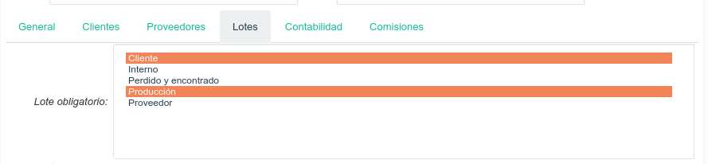

#:before:product/product:section:pestanas#

Para indicar que un producto determinado debe tener asignado obligatoriamente
un lote, debemos ir a la pestaña  **Lotes** y seleccionar los tipos de
ubicaciones en que queremos que este lote sea obligatorio.

Esto hará que cuando se procese un movimiento de existencias de este producto
sea obligatorio un lote especificar un lote si el producto se esta recibiendo
o enviando desde una ubicación de los tipos seleccionados. Por ejemplo, en la
imagen anterior, el lote será obligatorio cuando hagamos una recepción de
proveedor, una devolución al mismo, un envío a cliente o una devolución de
cliente, ya que todos estos movimientos pasan por una ubicación de tipo
Proveedor o Cliente. Además, el lote no será obligatorio para los movimientos
internos en nuestro almacén, ya que no hemos marcado ni Almacenamiento ni
Producción, ni tampoco para los Inventarios, ya que tampoco hemos marcado
la opción Perdido/Encontrado.

.. |menu_template| tryref:: product.menu_template/complete_name
