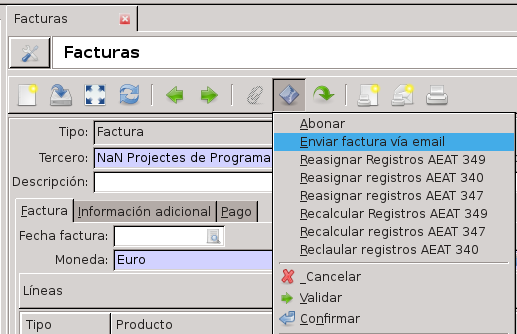

==================
Acciones en Tryton
==================

Una *acción* en Tryton es un asistente que realizará cálculos para generar unos
valores nuevos o nuevos registros. Generalmente una acción abre una ventana
flotante, que contendrá un formulario, para completar y procesar dicha
información.

--------------------
Desde la vista lista
--------------------

Para ejecutar una acción desde la vista de lista hay que:

 * Seleccionar los registros de la lista sobre los que queremos ejecutar la
   acción. Para ello es suficiente hacer clic con el ratón en el primero de los
   registros, pulsar la tecla **Mayúsculas** y sin soltarla, marcar el último
   de los registros que deseamos incluir en la selección. Si los registros no
   están consecutivos, si no que deseamos seleccionar registros "salteados", en
   lugar de pulsar la tecla **Mayúsculas**, pulsaremos la tecla *Control* e
   iremos marcando uno por uno los registros que queramos incluir en la
   selección.

 * Hacer clic en sobre icono **Ejecutar acción** y seleccionar la acción que se
   desee ejecutar.

-------------------------
Desde la vista formulario
-------------------------

Desde la vista de formulario, sólo se puede ejecutar acciones para el registro
que esté abierto en ese momento, y el procedimiento es el mismo que desde la
vista de lista.

   Acción desde un pedido de venta para el envío de correo electrónico en Tryton

.. _nueva-accion:

-------------------------
Crear acciones de ventana
-------------------------

Por medio del menú ventana acceredemos a un listado de todas las
acciones de ventana predeterminadas. Desde aquí podremos crear nuevas acciones
o duplicar las predeterminadas para poder modificarlas a nuestro gusto.

.. warning:: No es recomendable modificar ninguna vista de las
   predeterminadas ya que estas son compartidas por todos los usuarios y puede
   provocar errores en la gestión realizada por estos.

Para crear una nueva acción clicaremos en el botón *Nuevo* y se nos abrirá la
Vista formulario que deberemos rellenar según la tipología de la acción que
queramos crear. Los campos a rellenar son:

* Modelo: Aquí indicaremo sobre qué modelo vamo a realizar la vista.

* uso: Este campo lo dejaremos en blanco a no ser que la vista esté
  destinada a ser una sección del Escritorio, en tal caso deberemos de indicar
  que el uso será *dashboard* (todo en minúsculas). De esta manera,
  podremos seleccionar la vista desde la configuración del Escritorio.

* vistas: Las acciones de ventana pueden tener diferentes vistas (arbol,
  formulario, calendraio, gráfico...). En caso de que la vista esté
  destinada al *Escritorio* solo se utilizará la primera de la lista.

* dominios: no afectan al escritorio, pero definen en qué estado pueden
  estar los modelos.

* valor del dominio: mostrará la informaicón que deseemos, podemos seleccionar qué
  estado de modelo queremos visualizar. No podremos modificarlo desde el
  escritorio.

  .. code::

     Registros en estado borrador: [('state', '=', 'draft')]

     Registro en estado borrador o finalizado [('state', 'in', ('draft', 'done'))]

* valor del contexto: el tipo de información que se muestra, habitualemten vendrá
  predefinido por la acción de ventana.

* orden: como se ordena la información a mostrar.

 .. code::

     Fecha de creación ascendente:  [('create_date', 'ASC')]

* Criterio de búsqueda: filtro que se aplica por defecto i que despues se puede modificar
  desde la barra de búsqueda de la pestaña.

  .. code::

     Tercero que contenga la letra "j" [('party', 'ilike', '%j%')]

* Límite: nombre de registro máximos que se mostrarán.

En la pestana *Acciones de teclado* indicaremos la ruta de acceso que queremos
que tenga la nueva acción. En caso de que la nueva Acción de ventana esté
destinada al escritorio, deberemos dejar el campo en blanco.

.. Note:: En caso de realizar un duplicado de alguna vista tenemos que
          acordarnos de eliminar las Acciones de teclado desde la pestaña
          correspondiente de la copia para que esta no tenga la misma ruta de
          acceso de menú que la original.

También podremos elegir que grupo de usuarios tendrán acceso a esta acción de
ventana desde la pestaá *Grupos*.

Creación de filtros y dominios
------------------------------
Para crear nuevos filtros o dominios seguiremos el orden ``[('nombre.campo',
'relación', 'condición')]``.

* *Nombre.campo*: incidaremos aquí sobre qué campo queremos que se realice
  la búsqueda.

* *Relación*: La relación que se ha de cumplir entre el nombre.campo y la
  condición.  Algunos ejemplos:

  .. code::

     '=', '<', '<=', 'like' (como =), 'ilike' (para que no distinga
     entre mayúsculas y minúsculas)

* *Condición*: Aquello que se ha de cumplir un registro para que aparezca
  en la búsqueda. Algunos signos útiles:

  .. code::

    '¡condición' (diferente a 'condición'), %condición% (cualquier
    resultado antes y depues de 'condición'

