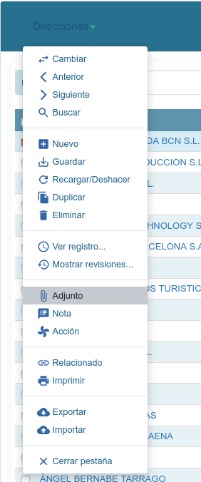

========
Adjuntos
========

Cualquier registro de Tryton le podemos relacionar documentos adjuntos (pdf,
imagenes,...). En el registro, en sus preferencias, podemos seleccionar la opción
''Adjuntos''. En una ventana flotante, le podemos seleccionar nuestro fichero y
subir al servidor de Tryton ERP o acceder a los documentos adjuntos que se dispone
en el registro.

   Acceso a adjuntos de cualquier registro en Tryton

.. warning:: Para el uso de ficheros adjuntos se debe, a nivel de servidor, 
   configurar la ruta del directorio donde se guardaran los ficheros (data_path)