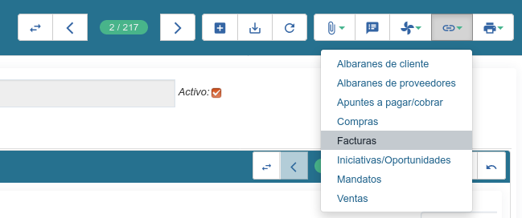

=======================
Acceso directo (atajos)
=======================

Un *atajo* en Tryton es un menú que permite abrir una nueva vista accediendo
únicamente a los registros de un determinado documento de la base de datos
relacionados con el registro actual.

-----------------------
Desde la vista de lista
-----------------------

Para ejecutar una acción desde la vista de lista hay que:

* Seleccionar los registros de la lista sobre los que queremos abrir el atajo.
  Para ello es suficiente hacer clic con el ratón en el primero de los registros,
  pulsar la tecla **Mayúsculas** y sin soltarla, marcar el último de los registros
  que deseamos incluir en la selección. Si los registros no están consecutivos,
  si no que deseamos seleccionar registros "salteados", en lugar de pulsar la tecla
  **Mayúsculas**, pulsaremos la tecla **Control** e iremos marcando uno por uno los
  registros que queramos incluir en la selección.

* Hacer clic en sobre icono **Atajo** y seleccionar el tipo de documento que se
  desea ver.

-------------------------
Desde la vista formulario
-------------------------

Desde la vista de formulario, sólo se pueden abrir documentos para el registro
que esté abierto en ese momento, y el procedimiento es el mismo que desde la
vista de lista.

   Atajos disponibles a Terceros en Tryton
