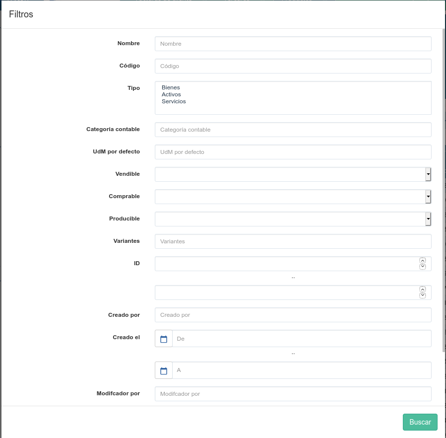

========
Buscador
========

Tryton incorpora un buscador inteligente para buscar/filtrar registros. Este buscador
únicamente se puede utilizar en la vista de lista.

   Buscador de Tryton: Agrupaciones, filtros y filtros extendidos

Su funcionamiento, pese a no ser muy intuitivo, es muy potente y con las opciones
contextuales que se muestran mientras se va escribiendo el contenido del filtro,
no es tan difícil como podría parecer en un principio.

También disponemos de un listado de las opciones de búsqueda por defecto si no
queremos escribir directamente en el campo de filtro:

   Buscador de Tryton. Listado de campos y opciones a listar

-------------
Filtro básico
-------------

Si lo que se desea es buscar un determinado registro conociendo el nombre del mismo,
basta con escribir dicho nombre para que, automáticamente, desaparezcan todos
los demás de la vista de lista.

---------------
Filtro avanzado
---------------

También es posible filtrar el contenido de la vista de lista utilizando otros campos
distintos del campo nombre. Para ello se debe escribir entre comillas el nombre
del campo por el que se desea hacer la búsqueda, dos puntos, y el contenido del
campo que se quiere obtener.

Hay que tener en cuenta que Tryton ofrece una ayuda contextual muy potente cuando
se está creando un filtro. Para ello únicamente es necesario escribir la primera
letra del nombre del campo por el que se desea buscar y automáticamente aparece
un menú contextual con los posibles candidatos para efectuar la búsqueda

Filtrar por fechas
==================

Por ejemplo, si se quiere obtener una lista de pedidos de venta desde una determinada
fecha, basta con escribir::

    "Fecha creación": >07/09/2011

Donde:

* Fecha creación: Es el nombre del campo por el que se desea hacer la búsqueda.
  Se puede utilizar cualquiera de los campos que aparecen en la parte superior
  de la lista.
* >07/09/2011: La fecha desde la que se quieren los registros

---------------
Filtrar activos
---------------

Como se comentó en los trucos de Tryton, `desactiar en lugar de borrar <tryton_trucos.html#desactivar-en-lugar-de-borrar>`_,
siempre es mejor desactivar un registro en lugar de borrarlo. Un registro desactivado
desaparece de las búsquedas, sin embargo, todavía puede ser consultado. Para ello
es suficiente definir el siguiente filtro::

    "Active": Falso

Esto quitará todos los registros activos y únicamente mostrará los registros
desactivados.

Filtrar por más de un criterio
==============================

Restringir la búsqueda con **and**
----------------------------------

Si se quiere depurar más la búsqueda de un determinado registro, se pueden ir añadiendo
nombres de campos y sus contenidos uno detrás del otro para ir reduciendo el contenido
de los registros encontrados. Esto es equivalente a ir añadiendo criterios de búsqueda
con el operador "**and**" (y).

Por ejemplo, y volviendo al ejemplo de las ordenes de venta filtradas por una determinada
fecha, si se quisiese ver, de las ordenes de venta mostradas, únicamente las ya han
sido confirmadas y se han convertido ya en una venta efectiva, podríamos escribir::

    "Fecha creación": >07/09/2012 Estado: Confirmada

De esta forma, además de filtrar (ocultar) las ordenes de venta creadas con anterioridad
a la fecha indicada, también filtraría las que su estado es distinto de "Confirmada".

Suavizar la búsqueda con **or**
-------------------------------

Sin embargo, también es posible que se necesite "suavizar" el criterio de búsqueda
para que muestre más registros de los que aparecerían con un único filtro. En este
caso, en lugar de utilizar el operador "**and**" utilizado por defecto cuando se
introduce más de un campo, debe utilizarse el operador "**or**".

Por ejemplo, si se desease obtener un listado de direcciones de compañías de las
ciudades de Madrid y Barcelona, no podría utilizarse el método anterior puesto
que al escribir::

    City: Madrid City: Barcelona

Lo que se está haciendo es buscar direcciones cuya ciudad es Madrid y Barcelona
a la vez. En su lugar hay que escribir::

    City: Madrid or City: Barcelona

También es posible escribirlo así::

    City: Madrid or Barcelona

En cuyo caso aparecerán todas las direcciones de compañía cuya ciudad es Madrid
o Barcelona.

-------------------------
Operaciones con el filtro
-------------------------

En las búsquedas podemos usar operadores para filtrar registros:

* =: igual a
* <: menor que
* <=: menor o igual que
* >: más grande que
* >=: más grande o igual que
* !=: no igual
* !: no igual o no como (dependiendo del tipo de campo)

Ejemplo de uso::

    Tercero: !trytonerp
