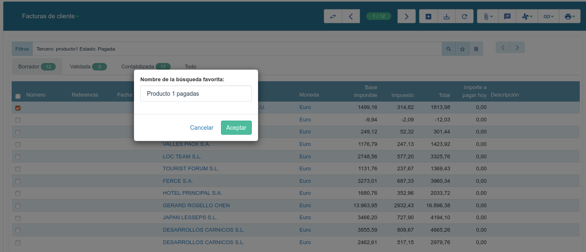
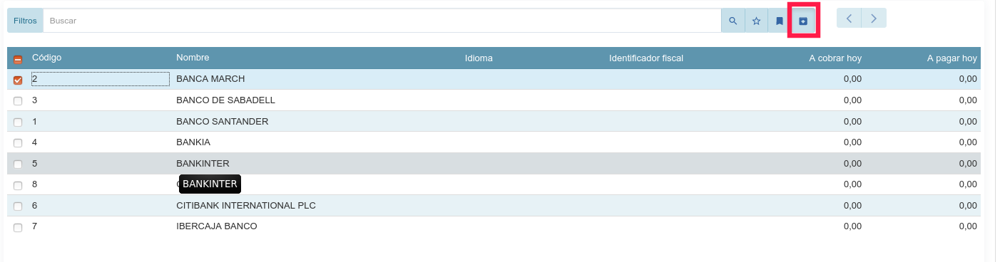

========
Buscador
========

Tryton incorpora un buscador inteligente para buscar/filtrar registros. Este buscador
únicamente se puede utilizar en la vista de lista.

.. figure:: images/tryton-buscar.png

   Buscador de Tryton: Agrupaciones, filtros y filtros extendidos

Tiene un funcionamiento muy potente, sugeriendo opciones contextuales que se 
muestran mientras vamos escribiendo el contenido en el filtro, facilitando la 
búsqueda o filtrado de datos. 

Si no queremos escribir directamente en el campo de filtro, también disponemos 
de un listado de las opciones de búsqueda por defecto.

.. figure:: images/tryton-buscar-opciones.png

   Buscador de Tryton. Listado de campos y opciones a listar

-------------
Filtro básico
-------------

Si lo que se desea es buscar un determinado registro conociendo el nombre del mismo,
basta con escribir dicho nombre para que, automáticamente, desaparezcan todos
los demás de la vista de lista.

---------------
Filtro avanzado
---------------

También es posible filtrar el contenido de la vista de lista utilizando otros campos
distintos del campo nombre. Para ello se debe escribir entre comillas el nombre
del campo por el que se desea hacer la búsqueda, dos puntos, y el contenido del
campo que se quiere obtener.

Hay que tener en cuenta que Tryton ofrece una ayuda contextual muy potente cuando
se está creando un filtro. Para ello únicamente es necesario escribir la primera
letra del nombre del campo por el que se desea buscar y automáticamente aparece
un menú contextual con los posibles candidatos para efectuar la búsqueda

-----------------
Guardar un filtro
-----------------

En Tryton es posible guardar una búsqueda o filtro para reutilizarlo siempre que 
se necesite. Los filtros son individuales para cada usuario.

En primer lugar debemos escribir o crear el filtro, pulsar enter y una vez 
tenemos los datos filtrados, podemos hacer clic en la estrella que podemos 
encontrar a la derecha del recuadro de búsqueda:

.. figure:: images/tryton-filtro.png

Esto nos mostrará un cuadro de diálogo para dar nombre al filtro:

Podemos acceptar y a partir de ese momento tendremos disponible el filtro 
siempre que lo necesitemos, en el icono que podemos encontrara a la derecha de 
la estrella:

Una vez seleccionado el filtro veremos como la estrella se nos muestra en 
amarillo (en vez de blanca):

En este momento podremos eliminar el filtro simplemente pulsando de nuevo sobre 
la estrella.

Filtrar por fechas
==================

Por ejemplo, si se quiere obtener una lista de pedidos de venta desde una determinada
fecha, basta con escribir::

    "Fecha creación": >07/09/2011

Donde:

* Fecha creación: Es el nombre del campo por el que se desea hacer la búsqueda.
  
* >07/09/2011: La fecha desde la que se quieren los registros

------------------------------------
¿Cómo encontrar registros inactivos?
------------------------------------

Como se explica en :ref:`desactivar-registros`, los registros pueden ser
desactivados. Para consultar los registros que hayan sido desactivados
podemos utilizar el filtro activo:

.. figure:: images/tryton-buscar-inactivos.png
   
   Buscar registros inactivos

O directamente escribiendo el siguiente filtro::

    Activo: Falso

Aplicando este filtro veremos todos los registros que hayan sido desactivados.

   Resultado de búsqueda de registros inactivos

Filtrar por más de un criterio
==============================

Restringir la búsqueda con "and"
----------------------------------

Si se quiere depurar más la búsqueda de un determinado registro, se pueden ir añadiendo
nombres de campos y sus contenidos uno detrás del otro para ir reduciendo el contenido
de los registros encontrados. Esto es equivalente a ir añadiendo criterios de búsqueda
con el operador "**and**" (y).

Por ejemplo, y volviendo al ejemplo de las órdenes de venta filtradas por una 
determinada fecha, si se quisiese ver, de las órdenes de venta mostradas,
únicamente las que ya han sido confirmadas y se han convertido ya en una venta 
efectiva, podríamos escribir::

    "Fecha creación": >07/09/2012 Estado: Confirmada

De esta forma, además de filtrar (ocultar) las órdenes de venta creadas con 
anterioridad
a la fecha indicada, también filtraría las que su estado es distinto de "Confirmada".

Suavizar la búsqueda con "or"
-------------------------------

Sin embargo, también es posible que se necesite "suavizar" el criterio de búsqueda
para que muestre más registros de los que aparecerían con un único filtro. En este
caso, en lugar de utilizar el operador "**and**" utilizado por defecto cuando se
introduce más de un campo, debe utilizarse el operador "**or**".

Por ejemplo, si se desease obtener un listado de direcciones de compañías de las
ciudades de Madrid y Barcelona, no podría utilizarse el método anterior puesto
que al escribir::

    City: Madrid City: Barcelona

Lo que se está haciendo es buscar direcciones cuya ciudad es Madrid y Barcelona
a la vez. En su lugar hay que escribir::

    City: Madrid or City: Barcelona

También es posible escribirlo así::

    City: Madrid or Barcelona

En cuyo caso aparecerán todas las direcciones de compañía cuya ciudad es Madrid
o Barcelona.

-------------------------
Operaciones con el filtro
-------------------------

En las búsquedas podemos usar operadores para filtrar registros:

* =: igual a
* <: menor que
* <=: menor o igual que
* >: más grande que
* >=: más grande o igual que
* !=: no igual a
* !: no igual o no como (dependiendo del tipo de campo)

Ejemplo de uso::

    Tercero: !trytonerp
