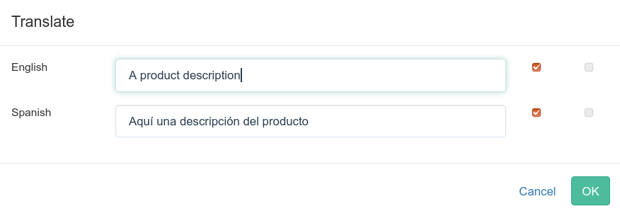
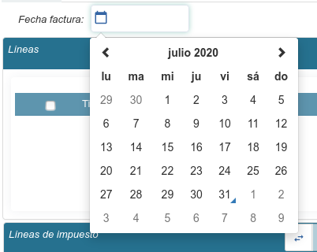
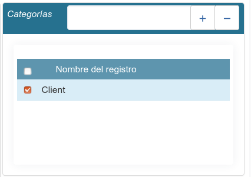

======
Campos
======

En las vistas formulario, si disponemos de privilegios de edición, podremos editar
o añadir información.

A continuación se listan algunos de los campos más comunes para la gestión de
cliente, facturas, productos, etc. que encontraremos en Tryton.

--------
Booleano
--------

Es la típica casilla de verificación. Sólo puede almacenar verdadero o falso.

Activo
------

Es un caso especial de campo booleano. Los campos **activo** (active) le permiten
ocultar elementos que ya no desea usar. ES recomendable "desactivar" del campo
*activo* del registro antes que eliminarlo.

-----
Texto
-----

Campo de texto de una única línea que permite almacenar cualquier carácter
alfanumérico. El tamaño se aplica en el nivel de almacenamiento y la entrada
del cliente.

Traducción
----------

Los campos que contengan una bandera le permite la traducción en varios idiomas.
Para traducir un campo, simplemente haga clic en el icono de la bandera i una ventana
emergente se mostrará el texto en cada idioma.

Si deseamos editar un idioma, le marcaremos la opción "Edita". Se nos activará la caja
de texto para rellenar la traducción.

Si en un idioma dispone del campo "Revisión" activado, esta traducción no estará
pendiente hasta que la edite (revise).

   Campos traducibles en Tryton

.. warning:: Si es un nuevo registro, antes de la traducción deberá guardar. En el caso
             que duplique un registro y cambie el contenido de un campo multi idioma,
             acuérdese de cambiar/editar en todos los idiomas.

--------
TextArea
--------

Campo de texto de múltiples líneas.

--------
Password
--------

Campo que contiene una cadena de texto que se almacenará encriptada mediante
el algoritmo `secure hash algorithm`_

.. _secure hash algorithm: http://es.wikipedia.org/wiki/Secure_Hash_Algorithm

---------------------
Entero / Entero Largo
---------------------

Un número entero (sin decimales). Puede contener valores negativos.

--------
Numérico
--------

Campo numérico de coma fija.

-----
Float
-----

Campo numérico de coma flotante.

--------------------------
Fecha, Fecha y hora y Hora
--------------------------

Campo de fecha. La visualización de la fecha viene relacionada con el formato de
fecha del idioma (menú **Administración/Localización/Idiomas**)::

    %d/%m/%Y

Si sois amantes del teclado, podéis interactuar con las fechas con los siguientes teclas (sin ":")

El día de hoy:

 * **=:** el día de hoy

Sumar fechas:

 * **y:** suma un año
 * **m:** suma un mes
 * **w:** suma una semana
 * **d:** suma un día
 * **h:** suma una hora
 * **i:** suma un minuto
 * **s:** suma un segundo

Restar fechas:

 * **Y:** restar un año
 * **M:** restar un mes
 * **W:** restar una semana
 * **D:** restar un día
 * **H:** restar una hora
 * **I:** restar un minuto
 * **S:** restar un segundo

   Campo fecha en Tryton

-------
Binario
-------

Permite seleccionar una fichero del disco duro

-------------------
Campos relacionales
-------------------

Many2One: De Varios a Uno
-------------------------

Son campos que permiten ver qué registro está relacionado con el registro que
estamos viendo en este momento. Por ejemplo: Un pedido de venta sólo puede estar
relacionado con un tercero. Un campo de este tipo, se mostraría en el pedido de
venta, y a través de él, se podría acceder a los datos del tercero.

Tienen tres botones asociados pero en todo momento sólo pueden verse un máximo
de dos:

 * Buscar registro <F2>: Permite seleccionar un registro dentro de la lista de
   registros existentes.
 * Abrir registro <F2>: Permite abrir el registro seleccionado para su edición.
 * Nuevo registro <F3>: Crea un nuevo registro para relacionarlo con el registro
   del formulario que estamos editando/creando actualmente.

   Selector de elementos de otros objetos

Para seleccionar un elemento:

 * Lupa del campo. Se nos listaran todos, y los podemos buscar
 * Escribimos un texto y tabulador. Sólo nos listaran los que coincidan con el
   texto escrito (se recomienda)

Many2Many: De Varios a Varios
-----------------------------

Se refiere a registros que pueden estar relacionados a la vez con varios registros
de otras tablas y viceversa. Por ejemplo: Una empresa puede pertenecer a una o a
varias categorías y cada categoría de empresas puede tener asociadas varias empresas.

Dispone de dos botones que permiten añadir registros a la relación (**+**) y quitar
registros de la relación (**-**), así como de un campo que permite filtrar el
resultado de la búsqueda que se realiza cuando se hace clic sobre el botón de añadir.

   Múltiples registros en Tryton

.. _tryton-campos-one2many:

One2Many: De Uno a Varios
-------------------------

Un ejemplo de campo *One2Many* son las direcciones de un tercero. Un tercero
puede tener varias direcciones y una dirección es solo de un tercero.

En el formulario que incluye un campo de estos veremos una lista con una serie
de botones para poder añadir, abrir, eliminar y recuperar el registre
seleccionado (deshacer la eliminación de una línea si aún no se ha guardado el
documento). Hay que tener en cuenta que cuando usamos este botón de eliminar,
cuando guardemos el documento el registro se eliminará definitivamente, no solo
se desligará del documento actual.

También encontramos botones para movernos por los diferentes
registros de la lista y para cambiar entre los tipos de vista (normalmente,
entre listado y formulario).

.. figure:: images/tryton-o2m-add_remove.png

En algunos casos nos podemos encontrar que un campo de este tipo tiene unos
controles adicionales: un campo de búsqueda y botones para añadir (+) y quitar
(-) líneas. Estos controles sirven para vincular y desvincular registros ya
existentes, comportándose en este caso como un campo *Many2Many*.

---------
Selección
---------

Permite seleccionar un valor de una lista de valores predeterminada. Por ejemplo:
'Hombre', 'Mujer'.
