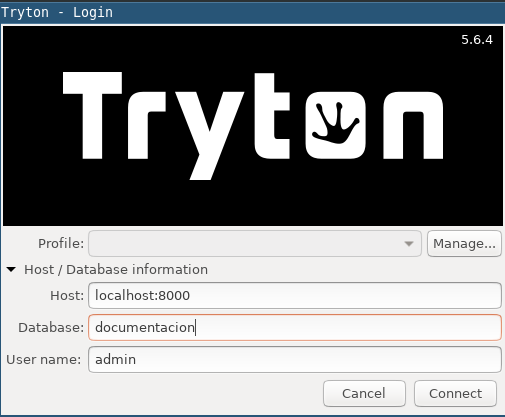

---------------
Conexión Tryton
---------------

Tryton es una aplicación ERP cliente-servidor.

Necesitaremos

* **Tryton Client** Aplicación de escritorio que se instala en las máquinas
  locales.
* **Tryton Server** Servidor de Tryton que se instala en servidores (técnico).

Para el uso de Tryton necesitamos:

* Conectividad a internet o a la red
* Acceso al servidor Tryton Server
* Trabajar con una base de datos

Clientes
========

Para conectarse a Tryton debemos utilizar el cliente GTK. La descarga se puede
realizar desde `descarga de Tryton`_

.. _descarga de Tryton: http://www.tryton.org/es/downloads.html

.. warning:: Consulte con su técnico que versión de Tryton debe usar. Debe usar
             la misma versión que la del servidor de Tryton. No podrá conectar
             si las versiones entre cliente y servidor no coinciden. 

Conexión
========

El cliente GTK de Tryton tiene por defecto un selector de perfiles en el que se
pueden configurar distintos datos de conexión a diferentes servidores. Para acceder
a él, hay que hacer clic sobre el botón "Administra Perfiles" de la ventana de login:

   Ventana de login del cliente Tryton

Para crear un perfil de conexión al servidor de Tryton, hay que hacer clic en el
botón Añade de la parte inferior izquierda y rellenar los siguientes datos:

* **Dirección IP o dominio del servidor**
* **Puerto** Por defecto 8000
* **Base de datos**: Seleccionar una del menú desplegable.
* **Usuario**

.. figure:: images/tryton-profile.png

   Perfiles del cliente Tryton

Una vez rellenados dichos datos, hay que hacer clic en el botón Aceptar y una vez
de nuevo en la ventana de login, sólo hay que seleccionar el perfil correspondiente
e introducir la contraseña para conectarse.

Selección base de datos
=======================

Cuando nos conectamos al servidor, podemos escoger la base de datos sobre la que
queremos trabajar. Esta selección se realiza desde la ventana de Administración
de perfiles.

Si deseamos trabajar con varias bases de datos, podemos abrir varios clientes de
Tryton para conectarnos a cada una de las bases de datos.

Ventana flotante pidiendo la contraseña
=======================================

Si el usuario esta inactivo cierto tiempo (por ejemplo, esta en una reunión o ha
salido de su espacio de trabajo) y se ha dejado el cliente GTK abierto, le pedirá
de nuevo la contraseña para entrar de nuevo sin cerrar el cliente.

Por defecto son 600 segundos de inactividad hasta que le pide de nuevo una contraseña.
Contacte con nuestros técnicos si desean un tiempo mayor de inactividad.
