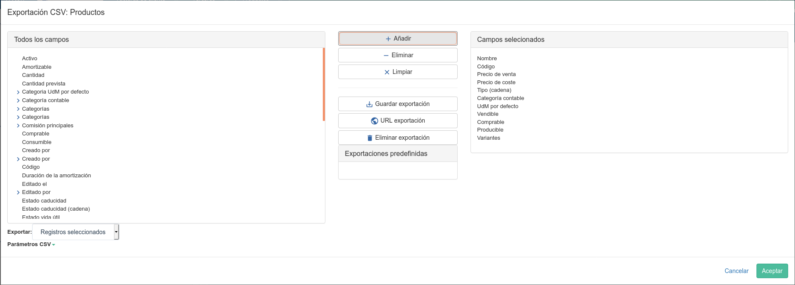
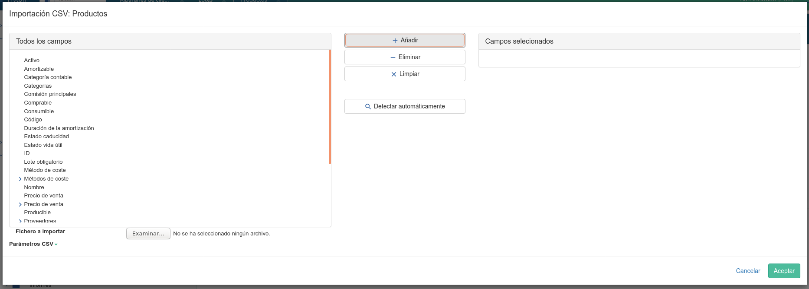

=======================
Importar/Exportar datos
=======================

Existen diferentes formas de exportar datos de nuestro ERP hacia otra aplicación.

Tryton ofrece, por defecto, un sistema básico de Importación / Exportación para
cualquier registro / modelo de nuestro ERP. Se usan ficheros CSV para la 
importación / exportación.
Estos ficheros los podras abrir con cualquier herramienta de hoja de cálculo, 
como el LibreOffice.

En todos los ejemplos para la importación / exportación de registros, nos 
situaremos en el lugar donde queremos hacer la acción. Por ejemplo, si deseamos 
exportar productos, iremos al listado productos. En el caso de importar 
terceros, deberemos abrir el listado de terceros.

--------------
Exportar datos
--------------

Para exportar a CSV en el icono de herramientas disponemos de la opción: 
**Exportar datos**.

El asistente de exportación nos creará, por defecto, un fichero CSV que lo 
podemos abrir con cualquier aplicación de hoja de cálculo (por ejemplo 
LibreOffice), aunque siempre podremos guardar el archivo con el formato que 
prefiramos.

Este asisten se divide en tres filas, la primera dónde veremos las 
*Exportacions predeterminadas*, una segunda fila dividida en tres columnas y 
una tercera línea de *Opciones*. Las tres columnas se dividen en:

* *Todos los campos*: Los campos disponibles a exportar.
* *Acciones*: Acciones a realizar para exportar.
* *Campos a exportar*: Los campos que exportaremos.

Seleccionaremos los campos de la columna de la izquierda (todos los campos) y con
la opción de *Añadir* se activarán en la columna de la derecha (campos a 
exportar).

También disponemos de más acciones:

* *Eliminar*. Elimina un campo de la columna *Campos a exportar*.
* *Limpiar*. Elimina todos los campos de la columna *Campos a exportar*.
* *Guardar exportación*. Permite guardar como favorito esta acción.
* *Eliminar exportación*. Permite un favorito ser eliminado.

En las *Opciones* nos permite escoger si el fichero CSV se abrirá con nuestro 
editor predeterminado de CSV o guardar el archivo en nuestro disco. En el caso 
de abrir un CSV, se abrirá con la aplicación predeterminada que tenga asignado 
a este tipo de ficheros.

Si tu aplicación predeterminada no abre CSV (por ejemplo, según que versión de 
Office Excel) los pasos a seguir son los siguientes:

 * Guardar el fichero en tu disco, en formato CSV
 
 * Abrir tu aplicación o editor (el ejemplo anterior, una versión de Excel que 
   no permita abrir el archivo directamente)
 
 * Desde la aplicación abre el archivo (sin haberlo abierto previamente) y 
   delimita las columnas y el formato del texto. 

   Exportación a CSV 

--------------
Importar datos
--------------

Muy similar con la acción *Exportar datos*. Esta acción importa **nuevos** registros
en el modelo que nos situamos para la importación.

Para la importación dispondremos de 3 columnas para:

* Todos los campos. Que campos disponibles tenemos.
* Acciones. Acciones a realizar para importar.
* Campos a importar. Los campos que importaremos del CSV.

Seleccionaremos los campos de la columna de la izquierda (todos los campos) y con
la opción de **Añadir** se activaran en la columna de la derecha (campos a importar).

También disponemos de más acciones:

* Eliminar. Elimina un campo de la columna *Campos a importar*.
* Limpiar. Elimina todos los campos de la columna *Campos a importar*.
* Auto-detectar. Revisa las cabeceras del CSV que concuerden con los campos del
  registro.

Para importar deberemos seleccionar el archivo de nuestro disco duro en *Archivos
a importar*, como si lo deseamos, podemos especificar los campos de nuestro CSV.

   Importación desde CSV

.. note:: Para importar datos, deberán añadir todos los campos que sean requeridos.
            Consulte con su técnico que campos son requeridos.

.. note:: El sistema de importación sólo crea nuevos registros; no modifica.
            Consulte con su técnico otras herramientas de importación.

.. warning:: El campo ID en la importación de datos no se debe usar. Si ha seleccionado
             este campo en la exportación de datos, deberá eliminarlo o no seleccionar
             en la lista de campos a importar.

----------
Tutoriales
----------

* `Importación de terceros mediante CSV`_
* `Importación de productos mediante CSV`_

.. _`Importación de terceros mediante CSV`: http://www.tryton-erp.es/posts/importacion-de-terceros-mediante-csv.html
.. _`Importación de productos mediante CSV`: http://www.tryton-erp.es/posts/importacion-de-productos-mediante-csv.html

