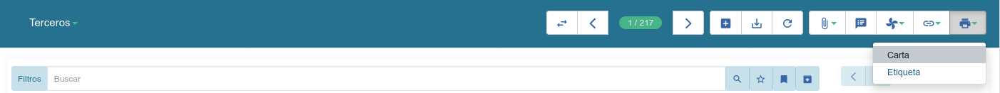

========
Informes
========

Tryton dispone en muchos objetos de un informe general: **Imprimir pantalla**.
Este informe imprime los registros y campos disponibles en la vista de lista.

Además, muchos de los principales objetos, disponen de informes por defecto:

* Venta
* Factura
* Albarán no valorado
* ...

-----------------
Acceso a informes
-----------------

Tryton dispone de tres botones para trabajar con informes. 

   Imprimir registros desde Tryton

Para trabajar con informes hay que:

* Seleccionar uno o varios registros.
* Hacer clic sobre el icono **Herramientas** y seleccionar el menú de impresión
  que se desee o hacer clic directamente sobre el icono de impresión adecuado.
* Escoger el tipo de informe que se desee imprimir.

Abrir informe
-------------

Tryton muestra el informe en el procesador de textos que se tenga definido por defecto
(Libre Office, Open Office, etc.) y permite su edición.

Informe por email
-----------------

Tryton abre el gestor de correos electrónicos que se tenga definido por defecto
y adjunta el informe para su envío.

Imprimir informe
----------------

Tryton muestra el informe en el procesador de textos que se tenga definido por
defecto (Libre Office, Open Office, etc.) en modo de sólo lectura.

El formato de los informes es `ODT`_. En su sistema deberá disponer de un software
de procesador de textos que pueda leer los formatos ODT. `LibreOffice`_ es un
procesador de textos ideal para la lectura de este tipo de formatos.

.. _ODT: http://es.wikipedia.org/wiki/OpenDocument
.. _LibreOffice: http://es.wikipedia.org/wiki/LibreOffice

Si se desea que la salida de los documentos sea con el formato PDF, consulte
con su administrador de sistema para activar esta opción.

Imprimir varios informes en un sólo documento
---------------------------------------------

En el caso de desear un informe de todos los registros en un sólo fichero (agrupado)
se debe activar esta opción.

Por ejemplo, deseamos imprimir varias facturas y estas nos las agrupen en un sólo fichero
(cada factura empezará en una nueva página y el fichero resultante contendrá múltiples
páginas). 

En la configuración del informe ( |menu_action_report| ) deberemos crear una acción
de teclado relacionado con:

* Modelo. Por ejemplo si el informe es una factura, el modelo será "Factura".
* Acción de teclado: Imprimir formulario

Con esto lo dispondremos en el icono de impresión la acción por defecto y la nueva
acción que hemos creado:

* Informe de cada registro en ficheros independientes (por defecto).
* Informe de todos los registros en un sólo fichero (agrupado) - (la que hemos creado).

.. |menu_action_report| tryref:: ir.menu_action_report_form/complete_name

--------------------
Personalizar informe
--------------------

La personalización de un informe es técnico. Contacte con su administrador
para que se adapten los informes según sus necesidades, tanto ya sean a nivel
gráfico (estética) como a nivel técnico (campos).
