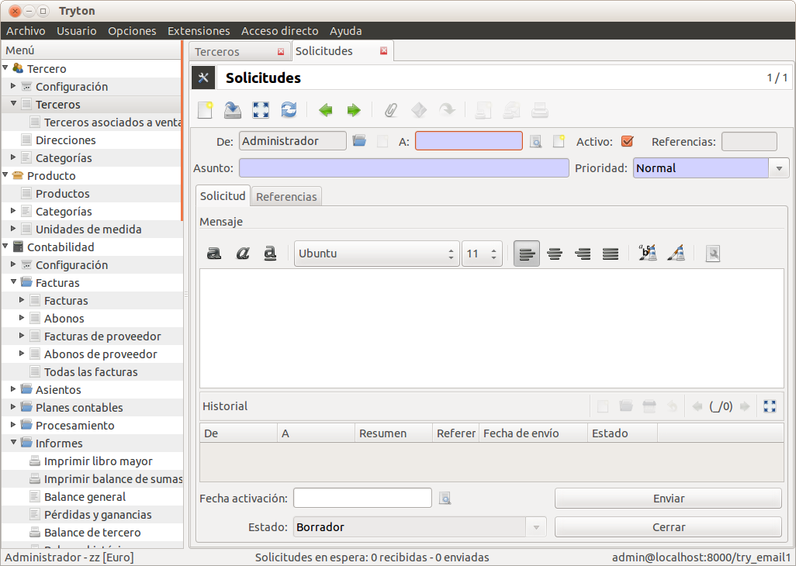

============================
Solicitudes o notificaciones
============================

Tryton le permite enviar notificaciones entre usuarios, al estilo de correo electrónico.
Asi mismo, también dispone de avisos del sistema de acciones planificadas. En la
parte inferior/central sabrá cuantas solicitudes enviadas y recibidas a la espera.

La forma más rápida de acceder a las solicitudes es mediante el menú superior
*Usuario/Leer mis solicitudes*. En este apartado sabrá las solicitudes nuevas
y enviadas.

Algunos módulos envian notificaciones a ciertos usuarios:

* **Informe de abastecimiento automático**. Se le informará de los abastecimientos
  automáticos realizados.
* **Planificador**: Notificación de errors obtenido mediante alguna tarea planificada.
* **Proyectos**. Notificaciones entre tareas de proyecto.
* **eSale**: Errores de sincronización con Magento, Prestashop...
