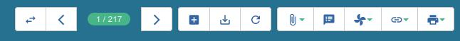

=====================
Barra de herramientas
=====================

Sólo son visibles cuando se tiene abierta alguna de las vistas de alguna de las
tablas de la base de datos:

   
   Barra de herramientas

Nuevo registro
--------------

**Botón Nuevo:** Permite crear un nuevo registro, en función de la vista sobre la
que trabajemos. Es decir, si hemos abierto la vista de compañías creará un nuevo
registro de compañía, si estamos en pedidos de venta, un nuevo pedido de venta, etc.
También se puede crear un nuevo registro pulsando simultáneamente las teclas Ctrl y N.

Guardar registro
----------------

**Botón Guardar:** Permite guardar las modificaciones realizadas en un registro.
Si estamos en el formulario de un cliente y cambiamos su dirección, no se guarda
hasta pulsar este botón. Si hemos modificado un registro y cambiamos de pantalla,
el sistema avisa que no hemos guardado. También se puede guardar un registro modificado
pulsando simultáneamente las teclas Ctrl y S

Borrar registros
----------------

**Botón Herramienta:** Tryton no tiene definido un botón para borrar un registro
en la Barra de Herramientas principal. Sí lo tiene en cambio en los campos
**múltiples** (m2m) de las vistas de formulario. En su lugar hay que acceder a través
del menú desplegable que se abre cuando se hace clic sobre el botón de las **Herramientas**.
Desde la vista de formulario esta opción borra el registro actual. En todo caso nos
pedirá confirmación. También se puede borrar uno o más registros desde la vista de
lista, seleccionándolo(s) previamente y pulsando las teclas Ctrl + D.
Nota: Sólo permitirá borrar aquellos elementos que no tengan objetos relacionados.

Por ejemplo, para borrar un cliente deberemos borrar antes sus pedidos.

.. figure:: images/tryton-delete.jpg

   Eliminar registro

Deshacer borrar registro
------------------------

**Botón Deshacer borrar registro:** Junto al botón de borrar registros descrito
en el apartado anterior, los campos múltiples (m2m) de las vistas de formulario
tienen otro botón que permite deshacer un borrado accidental de un registro antes
de guardarlo.

Cambio de vista (lista, formulario, gráfico)
--------------------------------------------

Casi todos los objetos existentes en Tryton pueden verse en los dos primeros
tipos de vistas.

* **Vista de Lista:** Es en la que se entra habitualmente por defecto cuando se
  hace doble clic en alguna opción del menú principal. Nos muestra una lista de los
  registros pertenecientes a este menú.
* **Vista Formulario:** Permite *abrir la ficha* del registro seleccionado. Es la
  que se utiliza para insertar o modificar datos de un registro, rellenando los
  campos solicitados.

Existen distintos tipos de campos en los formularios. Cada campo por defecto se
muestra de una determinada manera. Más adelante, dedicaremos un capítulo a los
tipos de campo de los formularios.

* **Vista Gráfico:** Habitualmente utilizada para mostrar estadísticas.

Los **Campos requeridos** aparecen en color azul. Indica que su inserción es
obligatoria, lo que significa que si no se introduce algún dato en dichos campos,
no dejará que guardemos el registro. Al intentar grabar, se muestran en rojo si
no han sido rellenados.

El usuario puede hacer clic repetidamente en dicho botón para cambiar el tipo de vista.

También se puede cambiar de vista pulsando simultáneamente las teclas Ctrl y L

Refrescar / Deshacer
--------------------

Permite refrescar la pantalla. Tiene varias utilidades: 

 * Para desechar los datos modificados de un formulario y recuperar los
   previamente guardados.
 * Para actualizar una pestaña para ver si han habido cambios provocados por otro
   usuario o por nosotros mismos al trabajar en otra pestaña (por ejemplo si tenemos
   abiertas empresas y contactos de empresas en dos pestañas diferentes y modificamos
   registros de la misma empresa). También se puede refrescar el contenido de un
   registro pulsando simultáneamente las teclas Ctrl y R.

Adelante / Atrás
----------------

Navegar por los registros. Permite ir hacia adelante o hacia atrás en la lista
de registros que hemos seleccionado en la pantalla de búsqueda. Aunque abramos
un registro concreto, el resto de los que se hayan encontrado siguen en memoria
por lo que podremos ir visualizándolos hacia adelante o hacia atrás. También se
puede ir hacia adelante y/o hacia atrás pulsando las teclas "Retrocede Página"
y/o "Avanza Página".

Archivos adjuntos
-----------------

Tryton incorpora un potente gestor documental que permite asociar archivos de
cualquier tipo a cualquier objeto. Por ejemplo, asociar un plano en la orden de
fabricación, o la solicitud de cotización enviada por un cliente por fax
previamente escaneado.

Acciones
--------

En muchas ocasiones los objetos llevan asociadas acciones que se pueden realizar
con ellos. Entendemos por objeto un registro. Mediante este botón, se ejecuta 
la acción o asistente para poder realizar una tarea en concreto sobre el objeto. 
Por ejemplo, en las empresas hay acciones para poder enviar correos electrónicos 
o SMS.

Si a un objeto no se le han definido acciones, este botón no tendrá utilidad para
dicho objeto.

También se puede realizar la acción sobre varios registros a la vez seleccionándolos
con el ratón y pulsando a la vez las teclas Ctrl y E.

Relacionados
------------

Muchos objetos están relacionados entre sí, este botón permite abrir, en una nueva
pestaña, los objetos que están relacionados con el registro que tenemos abierto
actualmente. Por ejemplo: Desde la vista de terceros, se puede acceder a sus
pedidos de venta, facturas, etc.

Informe
-------

Crea un informe y lo abre con el procesador de textos (Libre Office, Open Office,
etc.) para su edición.

Correo electrónico
------------------

Abre el programa de gestión de correos electrónicos para enviar un nuevo correo
electrónico, adjuntando el informe que se crea por defecto.

Imprimir
--------

En Tryton existen multitud de informes asociados a los objetos. Este botón permitirá
imprimir un listado, un pedido, una factura, una planificación, una tarea...

Evidentemente si a un objeto no se le han definido informes, este botón no tendría
utilidad para dicho objeto. 

Desde la vista lista se puede imprimir varios registros a la vez seleccionándolos
con el ratón y pulsando a la vez la tecla [Ctrl] (o [Mayús] para seleccionar un
bloque de registros).
