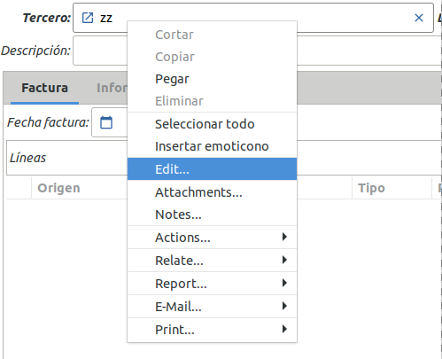

======
Trucos
======

Esas cosillas que le harán una tarea más fácil en la gestión de Tryton.

--------------------
Eliminar un registro
--------------------

Cómo se elimina un registro creado? A simple vista el botón de eliminación no
está visible. El motivo es simple, evitar que el usuario haga cosas que no debiera.
Si realmente desea eliminar un registro, la opción **eliminar** la encontrará en
el botón de herramientas (al lado del título). O bien, con la combinación de
teclado **Crt+D**. Una vez eliminado, no hay vuelta atrás.

.. tip:: Ciertos registros disponen del campo **Activo**. Si desactiva este campo
         estará disponible en su ERP pero no será visible. De esta forma podrá
         ocultar información y siempre después la podrá activar de nuevo si
         fuera necesario. A partir de este momento, si algún usuario intenta 
         buscar el tercero (producto o cualquiera que sea el dato que hemos 
         desactivado) ya no lo va a encontrar. Si lo desa, podrá buscarlo 
         explícitamente indicando que el campo *Activo* esté a *Falso*, ya sea 
         en la línea de filtro o en el filtro avanzado. 

-----------------
Atajos de teclado
-----------------

La mayoría de los botones tienen asociados **atajos de teclado** que permiten
agilizar el uso continuado de Tryton. Por ejemplo [Ctrl]+N para crear un Nuevo
registro, [Ctrl]+S para Guardarlo, [Ctrl]+D para Borrarlo, [Ctrl]+F para Buscar,
[Ctrl]+R para Refrescar, [Ctrl]+W para Cerrar la pestaña actual, [Av Pág] o
[Re Pág] para ir al registro Siguiente o Anterior...

Para ver todos los atajos de los que dispone Tryton, se puede ir abriendo cada
menú: el atajo de teclado asociado a cada submenú se muestra a la derecha del mismo.

----------------
Ayuda contextual
----------------

En las vistas de formulario, algunos campos disponen de una ayuda contextual que
ayudan a rellenar su contenido. Para verla, únicamente hay que dejar el puntero
del ratón sobre dicho campo y aparecerá la ayuda contextual.

---------------
Menú contextual
---------------

Haciendo clic sobre un registro con el botón derecho del ratón, se abre un menú
contextual en el que aparecen una serie de opciones que se pueden realizar con
dicho registro. Entre las opciones que se pueden realizar destacan Copiar, Adjuntos,
Acciones, Relacionado, Informes, etc. En cada momento únicamente aparecen habilitadas
(en negro) las que se pueden realizar, y en gris, las que no se pueden realizar
(deshabilitadas).

.. _desactivar-registros:

---------------------------
¿Cómo desactivar registros?
---------------------------

A veces no es posible eliminar registros ya que debemos conservar documentos
históricos que hacen referencia a los mismos (por ejemplo una factura sobre un
producto), pero queremos eliminarlo porqué sabemos que no lo vamos a
necesitar mas. En estos casos, debemos **desactivarlo** desmarcando la casilla
de verificación del campo **Activo**.

.. note:: La opción de desactivar registros sólo esta disponible en aquellos
    modelos que disponen del campo activo. Si el registro que intenta
    desactivar no dispone del campo activo, no se puede desactiva.

Una vez desactivado un registro este no nos aparecerá en las búsquedas, aunque
realmente exista en la base de datos. 
En :ref:`¿Cómo encontrar registros inactivos?<encontrar-inactivos>` se explica 
cómo buscar registros que hayan sido desactivados.

------------
Copiar/pegar
------------

Con el cliente GTK de Tryton se puede copiar-pegar desde cualquier vista de
lista a otra aplicación. Para ello únicamente hay que:

  * Hacer clic con el botón izquierdo del ratón sobre el primero de los registros
    que se desea copiar,
  * Pulsando la tecla **Mayúsculas** si se desea seleccionar registros consecutivos
    o la tecla **Control** si se desean seleccionar registros *salteados*, ir
    seleccionando los registros que se desean copiar y
  * Finalmente, sin soltar la tecla pulsada, hacer clic con el botón derecho del
    ratón sobre uno de los registros seleccionados para que aparezca el menú
    desplegable contextual en el que aparece la opción **Copiar**.

Si son varios registros a copiar, los puede seleccionar y copiar con las teclas
**Crt + c**.

Ahora se puede acceder a cualquier otra aplicación y pegar los registros
seleccionados con las teclas **Crtl + v**.

   Copiar registros de Tryton a otra aplicación

--------------------------------------------
Abrir el cliente GTK con valores por defecto
--------------------------------------------

En el caso de sistemas GNU/Linux, podemos hacer que nuestro icono de cliente de 
Tryton disponga valores por defecto para acceder directamente a un servidor y 
base de datos::

    $ tryton --user="demo" --port=8000 --server="demo2.4.tryton.org"

-----------------------------------------
Abrir más de una ventana del mismo objeto
-----------------------------------------

Cada vez que se hace doble clic en alguno de los menús de la izquierda del cliente
GTK de Tryton, se abre una pestaña si no estuviese ya abierta, y si ya estuviese abierta,
se iría directamente a ella, sin abrir una nueva. Este es el comportamiento por defecto.

Sin embargo, también es posible abrir dos o más pestañas del mismo objeto. Para 
ello únicamente es necesario pulsar la tecla **mayúsculas** y sin soltarla, 
hacer doble clic sobre el menú del objeto que se desea tener dos vistas abiertas 
a la vez.

----------------------------------------------------
Editar o visualizar información en una nueva pestaña
----------------------------------------------------

Ponemos un ejemplo: tenemos una factura. En una factura tenemos un campo
relacionado con el tercero. Si deseamos editar este tercero o visualizar su información,
una opción es abrir el registro con el icono de directorio (carpeta azul 
al lateral del registro) y se nos abrirá una ventana flotante con esta vista. 
Esta opción es sólo eventual ya que cuando cerramos la ventana, ya no 
dispondremos de la información del tercero.

Otra opción de abrir un tercero en este ejemplo, es en el campo tercero, con el botón
derecho, la opción **Editar**. En vez de abrirse en una nueva ventana la ficha del tercero,
se nos abrirá en una nueva pestaña. De este modo podemos continuar trabajando con el pedido
de venta y al mismo tiempo disponemos de la ficha del tercero también abierta.

Si a la vista del cliente queremos abrir un nuevo campo en una nueva pestaña, simplemente repetiremos
la opción de **Editar** para el campo que deseamos y se nos irán abriendo nuevas pestañas (que las
cerraremos cuando queramos).

   Editar un campo en una nueva pestaña
